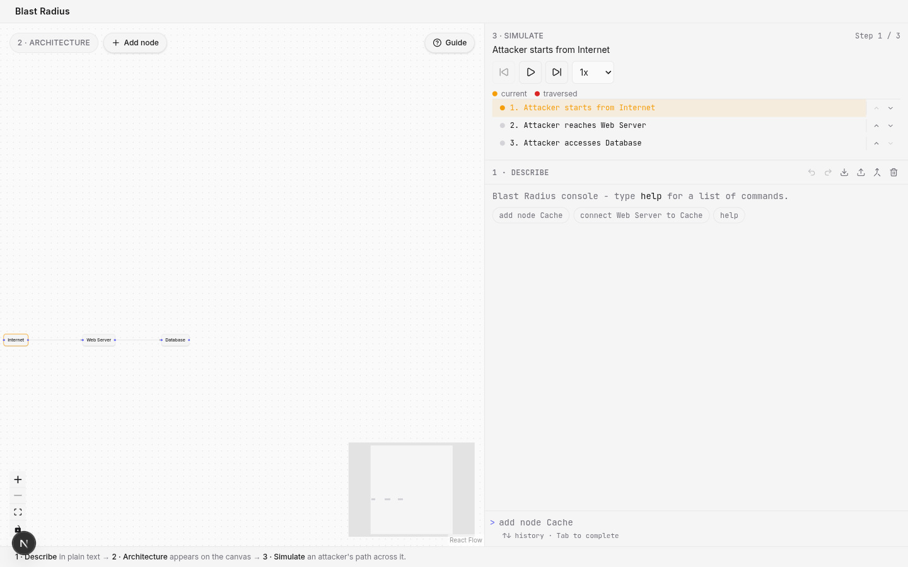
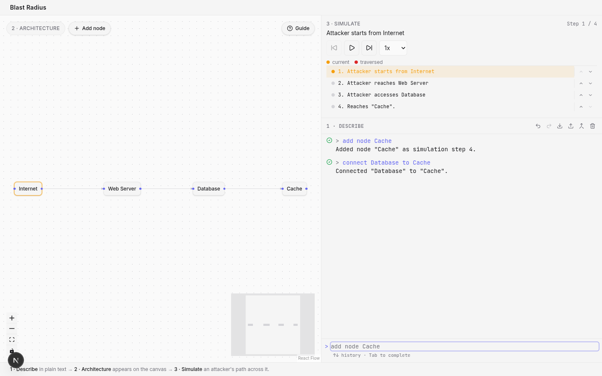
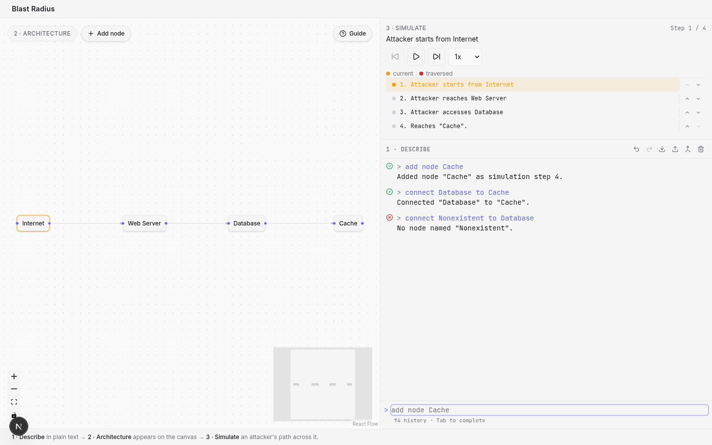
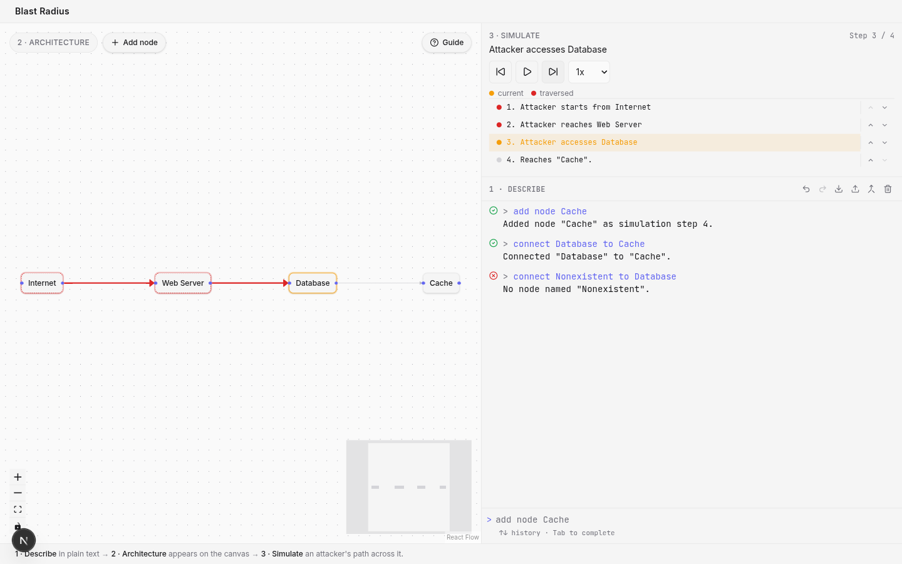
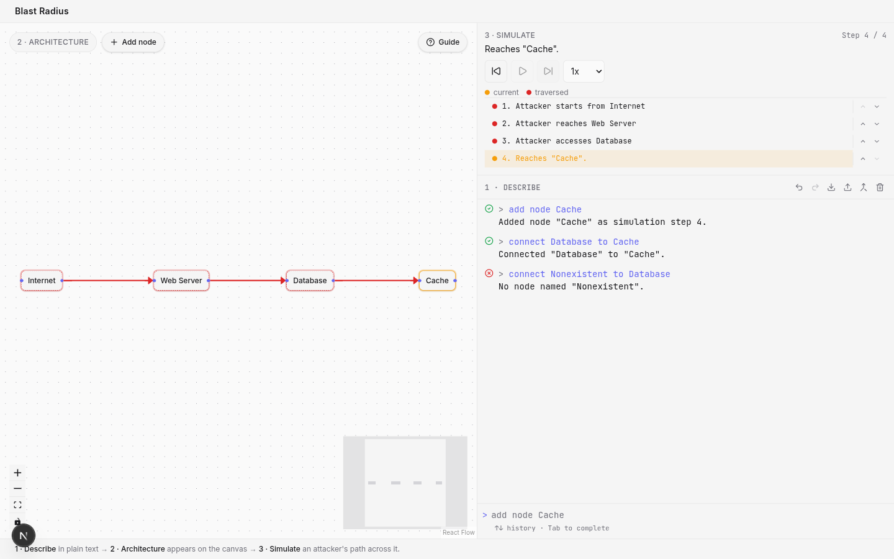

# architect-model

A small web app for updating a system architecture (nodes + edges) via text input, and exploring
a simulation trace through it. Visual editing mirrors text editing exactly - every mouse action
runs the same command a typed instruction would.

## Who this is for

As a security engineer reviewing a proposed design, I want to sketch an architecture in plain text
and step through a simulated attacker's path, to see what's reachable, in what order, and where the
blast radius stops. The seed data (`src/data/example-architecture.ts`) tells that story: "Internet →
Web Server → Database" - a node's position in `architecture.nodes` _is_ its simulation step.

## Demo proof


Red = traversed, amber = current, dashed green = added; five real screenshots of the same app,
saved to `docs/demo/`:

<table>
<tr><td align="center"><br><b>1. Before</b> - the seeded architecture, step 1 of 3.</td></tr>
<tr><td align="center"><br><b>2. After</b> - <code>add node Cache</code> + <code>connect Database to Cache</code>.</td></tr>
<tr><td align="center"><br><b>3. Validation</b> - an invalid command rejected inline; architecture unchanged.</td></tr>
<tr><td align="center"><br><b>4. Simulating</b> - current step ringed amber, traversed nodes/edges red.</td></tr>
<tr><td align="center"><br><b>5. Full trace</b> - final step; the whole attacker path traversed.</td></tr>
</table>

## Run locally

```bash
npm install
npm run dev
```

Open http://localhost:3000. `npm test` runs the unit tests; `npm run check` runs lint, typecheck,
format, and tests together.

## Supported commands

Typed into the console's command input. Node references match case-insensitively and by substring;
an unrecognized command or an ambiguous reference is rejected inline in the log. A dropdown
autocompletes node names as you type.

| Command                         | Aliases                                  | Example                           | Effect                                                        |
| ------------------------------- | ---------------------------------------- | --------------------------------- | ------------------------------------------------------------- |
| `add node <label>`              | `create node`, `new node`                | `add node Cache`                  | Adds a node as the next simulation step.                      |
| `connect <A> to <B>`            | `connect A and B`, `link A to/and B`     | `connect Web Server to Cache`     | Adds an edge; one outgoing/incoming edge per node, no cycles. |
| `remove node <label>`           | `delete node`                            | `remove node Cache`               | Removes the node, its edges, and its step.                    |
| `remove edge <A> to <B>`        | `delete edge`, `disconnect A from/and B` | `remove edge Web Server to Cache` | Removes the edge.                                             |
| `rename node <A> to <B>`        | `relabel node A to B`                    | `rename node Cache to Redis`      | Renames the node everywhere it's referenced.                  |
| `move node <label> to step <n>` | `reorder node`                           | `move node Cache to step 2`       | Reorders the node's simulation step.                          |
| `export`                        | -                                        | `export`                          | Downloads the architecture as `architecture.json`.            |
| `undo` / `redo`                 | -                                        | `undo`                            | Reverts / re-applies the last command.                        |

Undo/redo also have toolbar buttons, covering every command-driven change (typed or canvas-driven)
but not raw dragging; history is per-tab and clears on "Clear history" or a cross-tab sync.

Nodes are draggable (positions persist), double-click to rename, drag from an edge handle to
connect, and a hover-revealed × deletes - each mirrors a command above. **Import** replaces the
architecture with a validated JSON file; **Merge** picks nodes/edges, an insert step, and connects
two before confirming.

## History, simulation & multi-tab sync

The command log, architecture, current step, and playback speed persist to `localStorage` and
restore on reload (paused). **Clear history** resets to the seed; tabs sync via `storage` events.

The Simulation panel steps through `architecture.nodes` in order: **Prev**/**Next** navigate
manually, **Play**/**Pause** auto-advance at 0.5x-4x speed, current node ringed in accent, crossed
nodes/edges red. Steps can be dragged or reordered, both running `move node ... to step ...`.

## Key design decisions and assumptions

- Regex mini-syntax, not NLP: predictable, testable command forms, no LLM used or required.
- Pure, tested logic lives in `lib/`; components only call it.
- The simulation trace is embedded in node order and `data.description`, not a parallel structure.
- Node matching is case-insensitive substring; duplicate-label rejection is exact-match.
- The command log doubles as the validation UI - every command is appended with its outcome.
- Every canvas mouse action synthesizes and runs the same command text a user would type.
- Edges form a single linear path (one outgoing/incoming edge per node, no cycles); Import re-validates the same invariants against an untrusted file.
- Merge remaps a colliding incoming id/label rather than rejecting the file, reusing `add node`'s own disambiguation; From/To are namespaced `current:<id>`/`incoming:<id>` pre-remap.
  Insert at step splices the incoming block into `current.nodes`, re-laying out positions after it.
- `move node ... to step ...` re-lays out node x-positions to match the new step order; edges aren't rewired.
- `undo`/`redo` are two stacks of `{ command, snapshot }` pairs pushed by every mutating command; a fresh command clears redo, and history clears on hydration, cross-tab sync, or "Clear history".
- Node reference lookup's substring fallback is indexed by a suffix trie over every label, so a lookup costs O(query length) rather than O(nodes); the autocomplete dropdown reuses it.

## What I'd improve with more time

- A cross-tab `storage` event can overwrite local state with a remote snapshot mid-autosave; a real fix needs synchronous persistence or version tracking - out of proportion for this app's size.
- The page paints the seed architecture first, then swaps in localStorage's saved state on mount -
  a visible flash. A synchronous read would remove it but risks hydration-mismatch warnings, judged
  worse than the flash.
