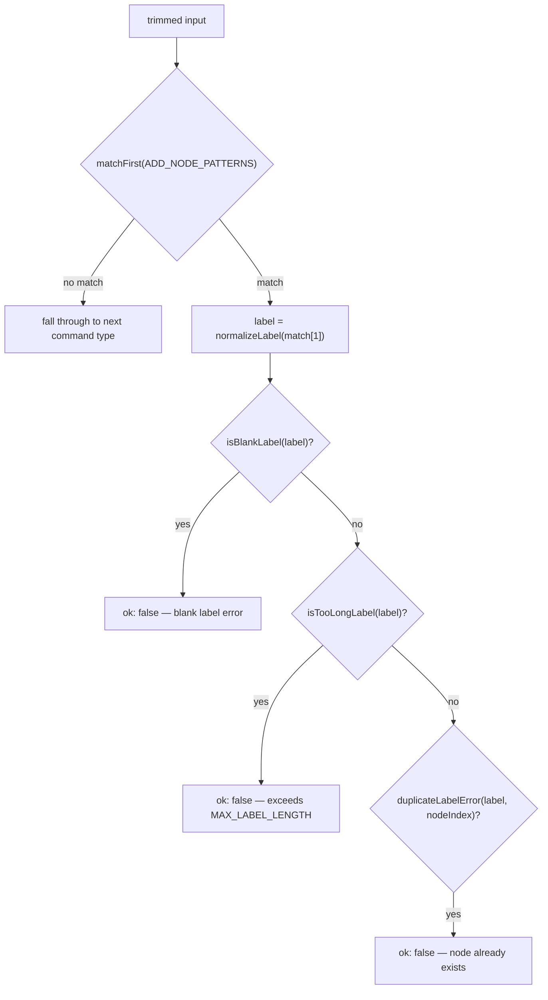
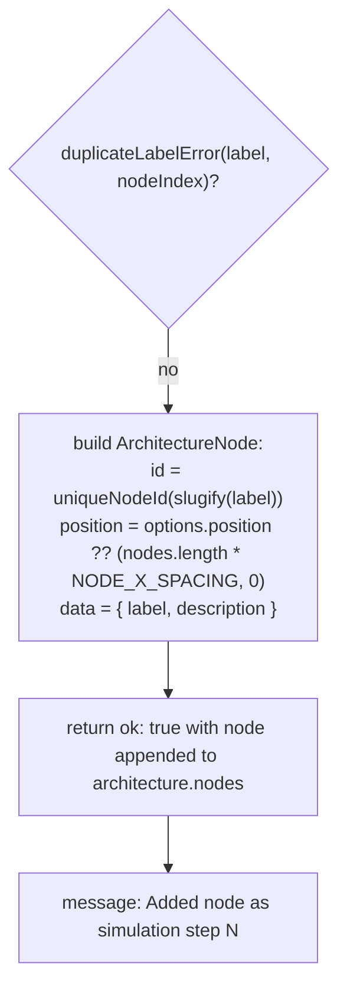

# `add node`

`ADD_NODE_PATTERNS` matches four command phrasings via `matchFirst`, runs the captured label through blank/too-long/duplicate checks, then builds an `ArchitectureNode` positioned at `architecture.nodes.length * NODE_X_SPACING` whenever `options.position` is absent, preserving left-to-right ordering.

**Source:** `src/lib/architecture-commands.ts:57-62,107-137`

**Matching and guard checks**

**Node construction and result**

