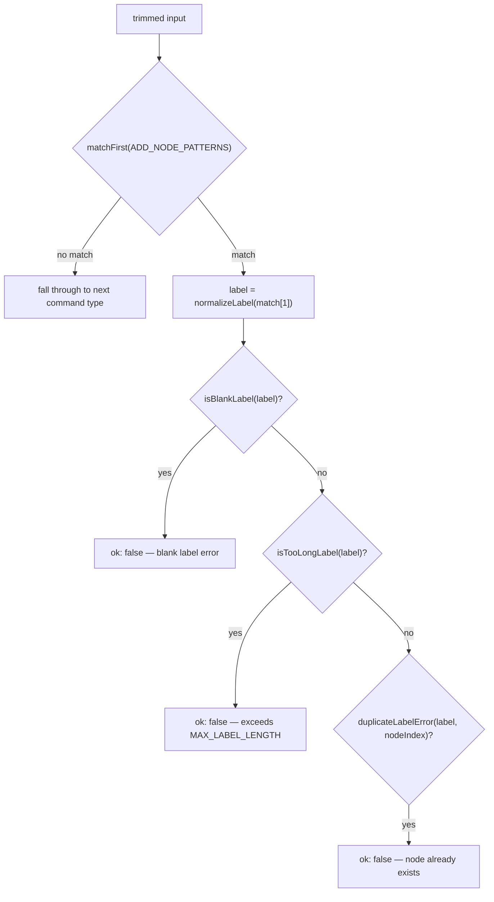
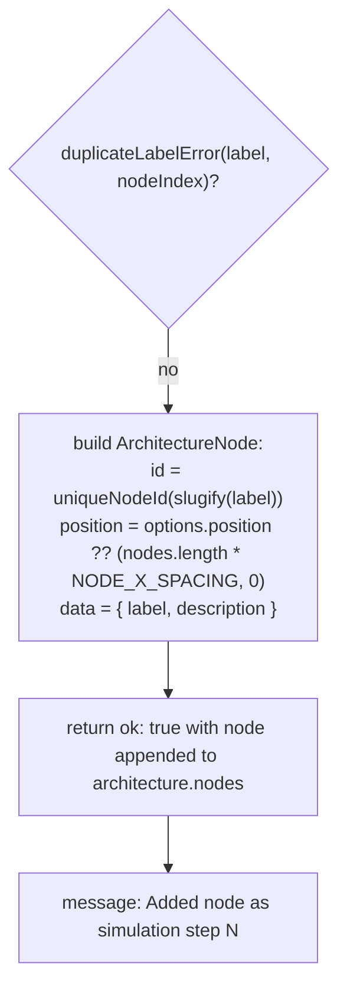

# `add node`

`ADD_NODE_PATTERNS` matches four phrasings ("add node", "create node", "new node", "add a node called") against the trimmed command via `matchFirst`, capturing everything after the verb as the label. Once matched, `parseCommand` runs the label through three guard checks in order -- blank, too long, then duplicate -- before building the new `ArchitectureNode`. Because every node in this app also doubles as a simulation step (nodes are rendered left-to-right as a trace), the new node is placed at `architecture.nodes.length * NODE_X_SPACING` when no explicit `options.position` is given, and the success message reports its 1-based step number rather than just confirming creation.

**Source:** `src/lib/architecture-commands.ts:587-592,648-679`

**Matching and guard checks**

**Node construction and result**

The diagram surfaces a detail easy to miss in the code: this handler never checks how the command originated -- it simply falls back to the spacing formula whenever `options.position` is absent. Per `ParseCommandOptions`'s doc comment, that field is only ever supplied by canvas-driven node creation, so a label typed into the command box always lands via the formula, keeping the left-to-right simulation ordering intact.
