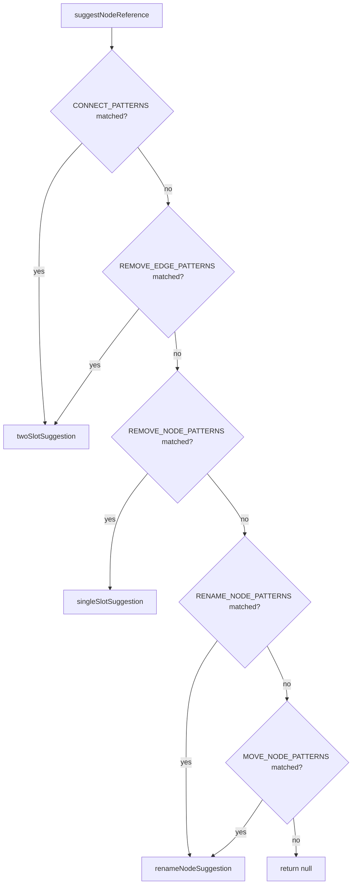
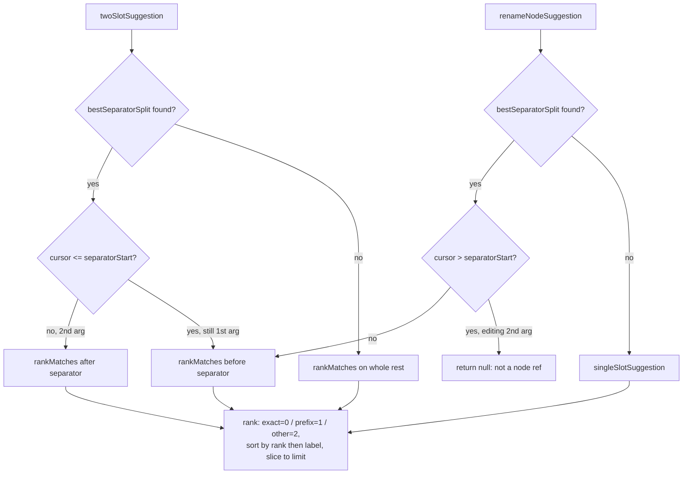

# Autocomplete suggestion ranking

`suggestNodeReference` powers live-typing autocomplete for the node-reference argument(s) of a typed command. It first dispatches on which command pattern (connect, remove-edge, remove-node, rename, move) matches the input, then routes to one of three slot helpers depending on how many node arguments that command takes and where the cursor sits relative to a separator like `to`. Candidate ranking (`rankMatches`) buckets substring matches into exact/prefix/other tiers before sorting alphabetically within each tier, and leans on `findNodesBySubstring`'s index so the lookup costs O(needle length) rather than scanning every node. `bestSeparatorSplit` disambiguates which separator occurrence splits the two arguments by preferring the split whose untouched side is already a complete, existing node label, falling back to the rightmost occurrence otherwise.

**Source:** `src/lib/node-suggestions.ts:1-288`

**Command pattern dispatch**

**Slot suggestion and match ranking**

The `bestSeparatorSplit` anchoring is what lets a separator word (`to`) appear inside a node's own label without being mistaken for the argument boundary: it only accepts a split as the boundary if the fixed side is a real node label, otherwise it keeps scanning rightward.
