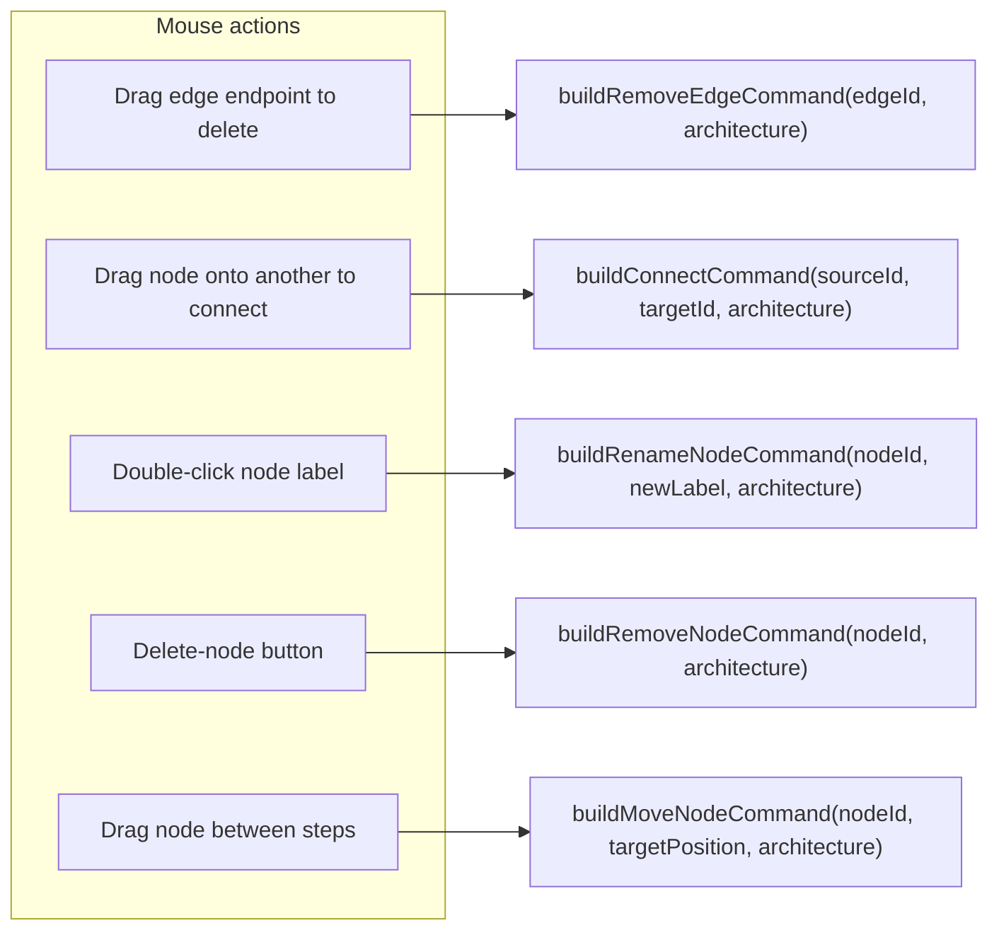
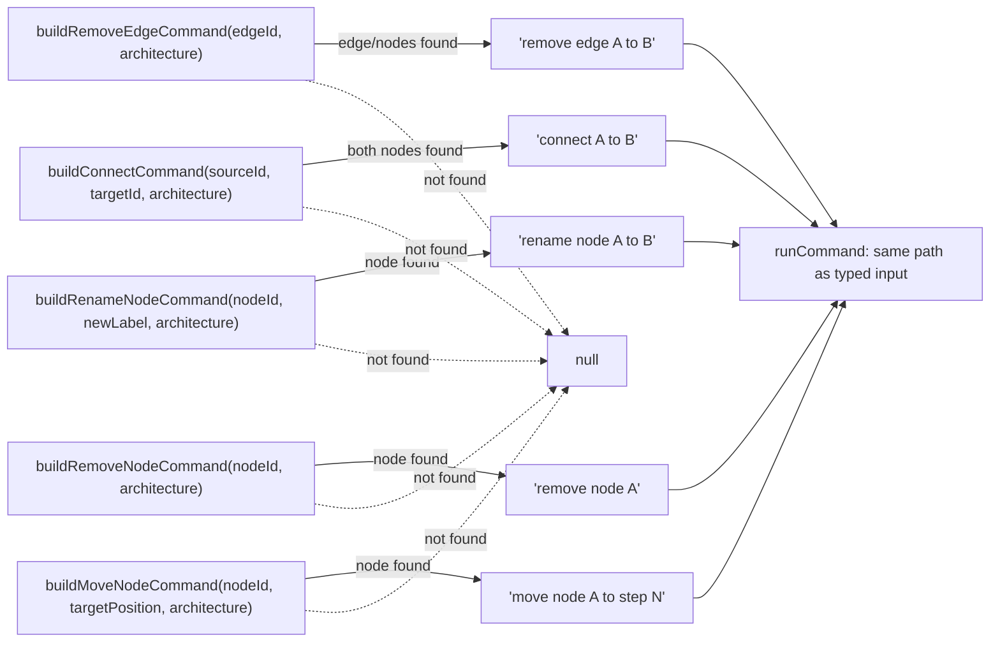

# Canvas mouse-to-command synthesis

`src/lib/canvas-commands.ts` translates React Flow mouse gestures (drag-connect, delete, double-click rename, drag-reorder, pane double-click to create) into the same plain-text command strings the typed command box accepts, by looking up each node/edge's current label via a shared `findNode` helper and interpolating it into a template string (e.g. `` `connect ${source.data.label} to ${target.data.label}` ``). Every builder returns `string | null`, failing closed to `null` when a referenced node or edge id is not found in the current `Architecture`, so a stale canvas interaction never produces a malformed command. Routing every mouse action back through the text-command parser (rather than mutating state directly) means canvas and typed edits share one code path, one history/undo mechanism, and one validation surface. `isDoubleClick` is a separate concern in the same file: it emulates native double-click detection (time + distance thresholds) for `onPaneClick`, since React Flow's pane click handler doesn't provide one.

**Source:** `src/lib/canvas-commands.ts:1-157`

**Mouse gesture to command builder**

**Builder result to command execution**

The diagram makes visible that all five builders funnel into the same `null`-on-miss failure branch and the same downstream `runCommand`, so a canvas gesture on a node that has just been deleted elsewhere silently becomes a no-op instead of throwing.
