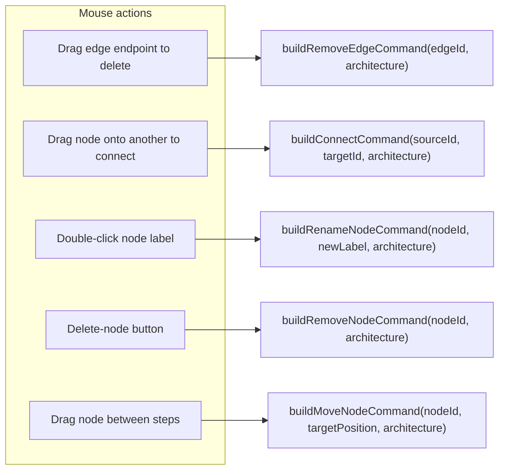
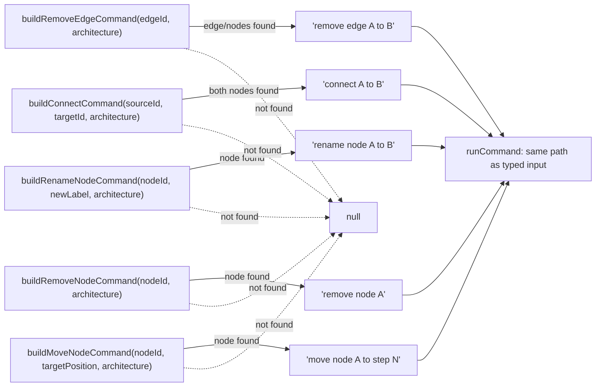

# Canvas mouse-to-command synthesis

`src/lib/canvas-commands.ts` translates React Flow mouse gestures like drag-connect and double-click rename into the same plain-text command strings the typed command box accepts, funneling both into the same downstream `runCommand`.

**Source:** `src/lib/canvas-commands.ts:1-122`

**Mouse gesture to command builder**

**Builder result to command execution**

