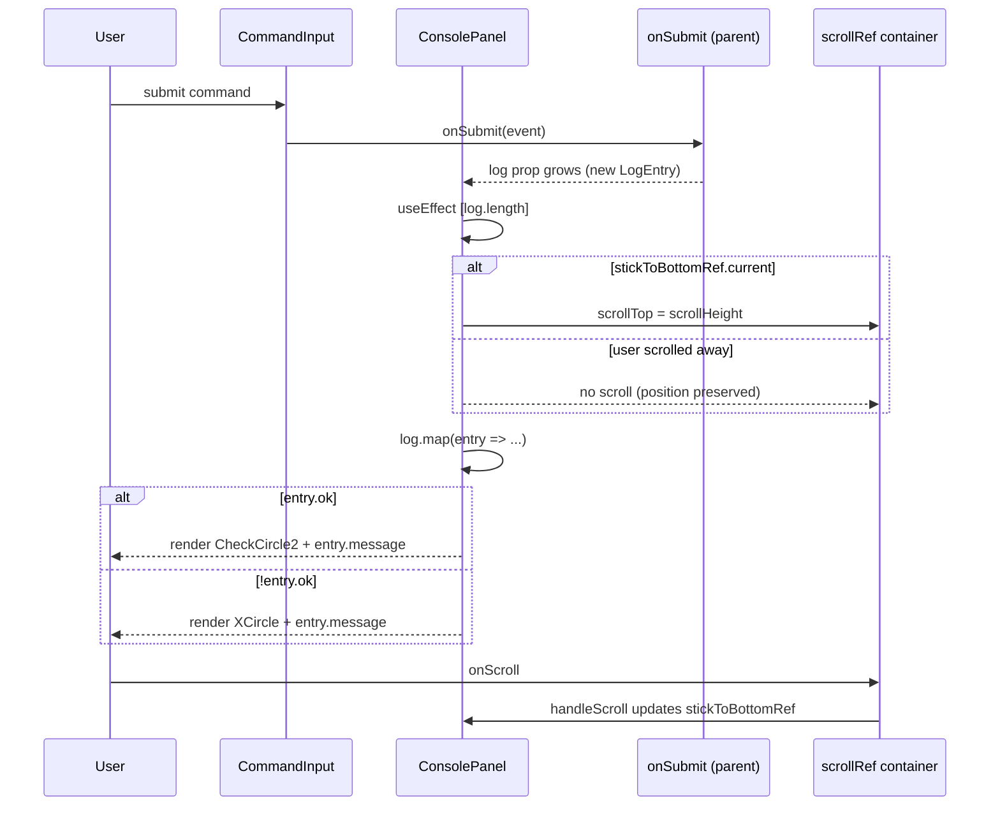

# Command console / change log

`ConsolePanel` renders a REPL-style history of submitted commands: a scrolling
list of `LogEntry` items (`id`, `input`, `ok`, `message`) followed by the live
`CommandInput` prompt. It owns no command-execution logic itself -- `log` and
`onSubmit` are props from the parent workspace, and `CommandInput`'s `<form
onSubmit={onSubmit}>` wires straight through to it. The toolbar (undo/redo,
export/import/merge, clear) is exposed as icon buttons, with import/merge each
driven by a hidden `<input type="file">` whose `value` is reset in
`handleFilePicked` so re-picking the same file still fires `onChange`. Auto-scroll
is gated by `stickToBottomRef`, set in `handleScroll` from the pre-update
scroll position so a user who has scrolled up to read older output is not
yanked back down when a new entry arrives.

**Source:** `src/components/console-panel.tsx:1-246`

The scroll-gating detail is easy to miss from the JSX alone: `stickToBottomRef`
is updated only by `handleScroll`, not by the log-driven effect, which is what
lets the ref represent "was the user at the bottom before this change" instead
of always reading true right after the container grows.
