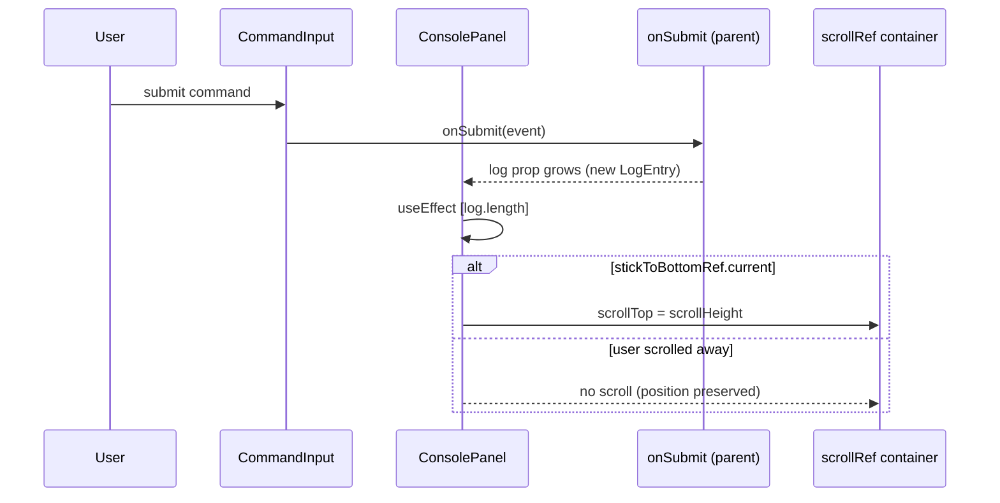
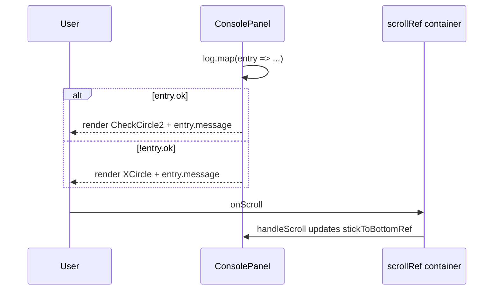

# Command console / change log

`ConsolePanel` gates auto-scroll with `stickToBottomRef`, updated only by `handleScroll` from the pre-update scroll position, so the ref tracks whether the user was at the bottom before the change rather than after the container grows.

**Source:** `src/components/console-panel.tsx:1-260`

**Submission and auto-scroll**

**Entry rendering and scroll tracking**

