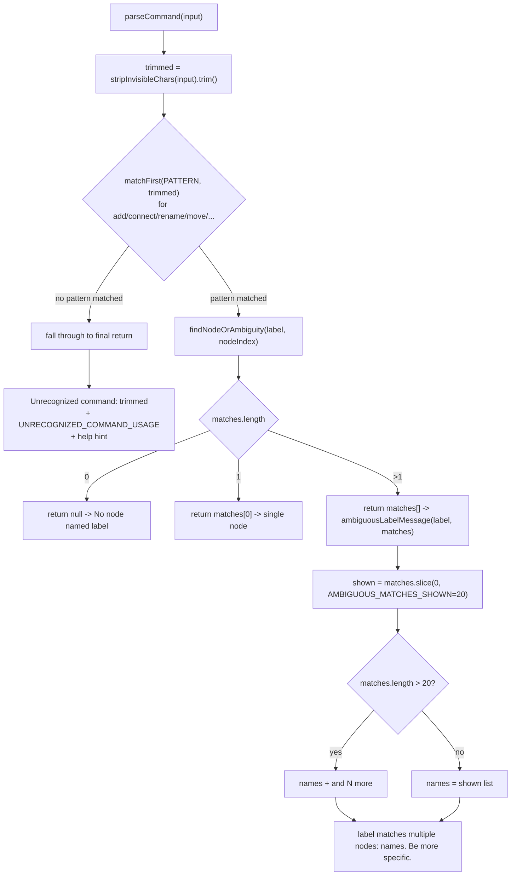

# Unrecognized / ambiguous command errors

`parseCommand` tries each command pattern (add-node, connect, rename, move, ...) against the trimmed input in sequence; if none of the `matchFirst(PATTERN, trimmed)` checks match anything, execution falls through every branch to the final `return` at the bottom of the function, which reports the input as an unrecognized command and lists usage. A second, unrelated kind of error happens *inside* a matched branch: when a typed label resolves via substring search to more than one node, `findNodeOrAmbiguity` returns an array instead of a single node, and `ambiguousLabelMessage` formats that array into a message. That formatter caps the listed names at `AMBIGUOUS_MATCHES_SHOWN` (20) and folds any remainder into an "and N more" suffix so a label matching hundreds of nodes doesn't produce an unreadable wall of text.

**Source:** `src/lib/architecture-commands.ts:201-214,729-731`

The 20-match cap is the non-obvious part: `ambiguousLabelMessage` is only reached once a label already matched *more than one* node, so the cap exists purely to bound the error message's own length, not the search itself.
