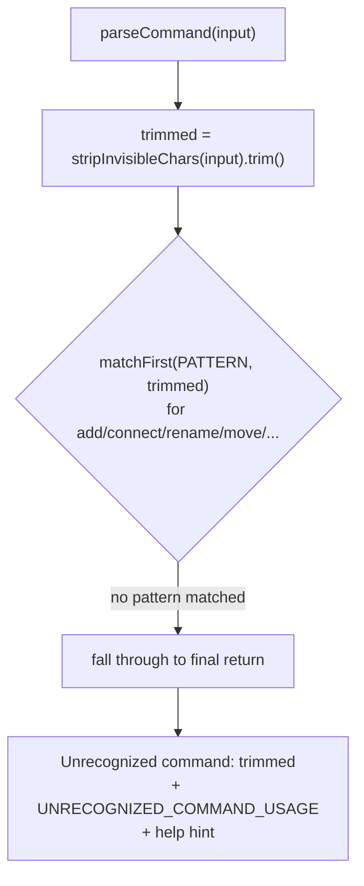
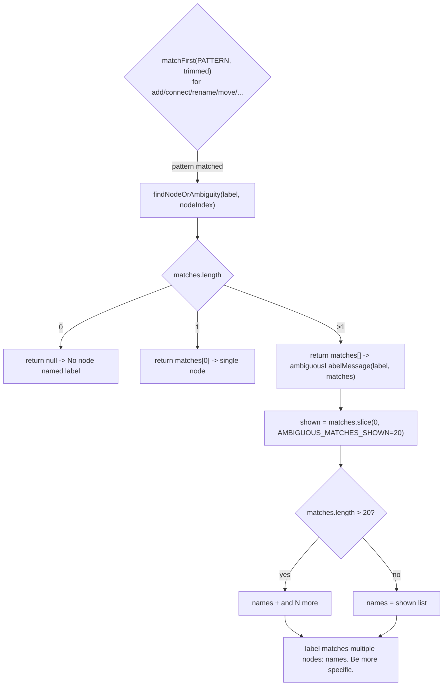

# Unrecognized / ambiguous command errors

When `findNodeOrAmbiguity` resolves a label to more than one node, `ambiguousLabelMessage` caps the listed names at `AMBIGUOUS_MATCHES_SHOWN` (20), appending an "and N more" suffix so a label matching hundreds of nodes stays readable.

**Source:** `src/lib/architecture-commands.ts:292-313,933-935`

**Pattern matching and unrecognized commands**

**Node resolution and ambiguity messaging**

