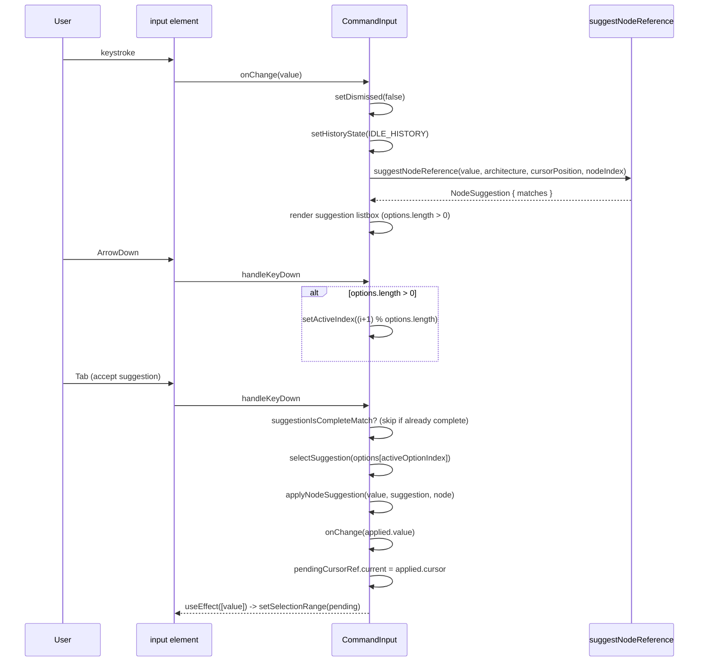
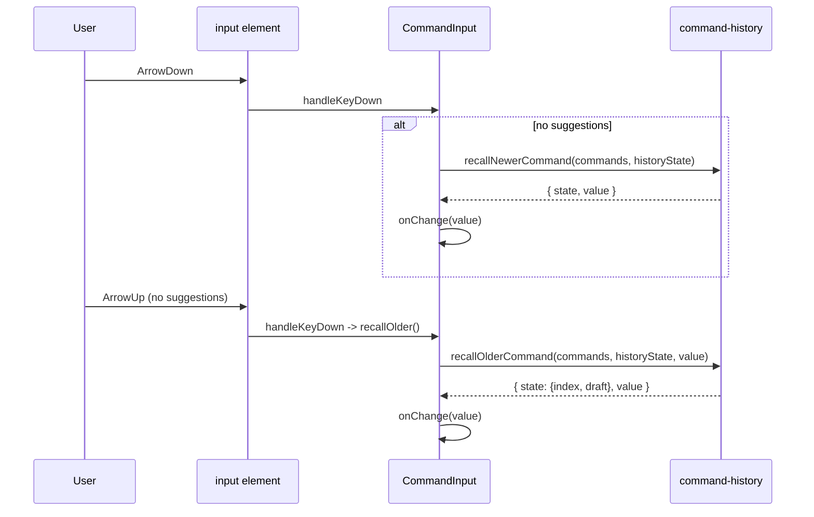

# Command input (autocomplete + Up/Down recall)

`CommandInput` is a controlled text field that layers two independent behaviors onto one `<input>`: inline node-reference autocomplete and shell-style history recall. On every render it calls `suggestNodeReference(value, architecture, cursorPosition, undefined, nodeIndex)` to compute the current argument's suggestion list; `handleKeyDown` branches entirely on whether that list is non-empty, so Up/Down/Enter/Tab drive the suggestion popover (`ArrowUp`/`ArrowDown` cycle `activeIndex`, `Enter`/`Tab` call `selectSuggestion` unless `suggestionIsCompleteMatch` says the reference is already unambiguous) while the same keys fall through to `recallOlderCommand`/`recallNewerCommand` once there are no suggestions to navigate. Suggestion selection writes the picked node's text back into `value` via `applyNodeSuggestion`, then queues the new caret offset in `pendingCursorRef` because the DOM node doesn't reflect the updated `value` until after this render — a `useEffect` keyed on `value` applies it with `setSelectionRange` next tick.

**Source:** `src/components/command-input.tsx:1-246`

**Autocomplete suggestion flow**

**History recall flow**

A subtle detail the diagram makes visible: `handleKeyDown` checks `options.length > 0` first, so Up/Down is never simultaneously "cycle suggestions" and "recall history" — the moment a suggestion list appears, history recall is fully shadowed by suggestion navigation for those same keys.
