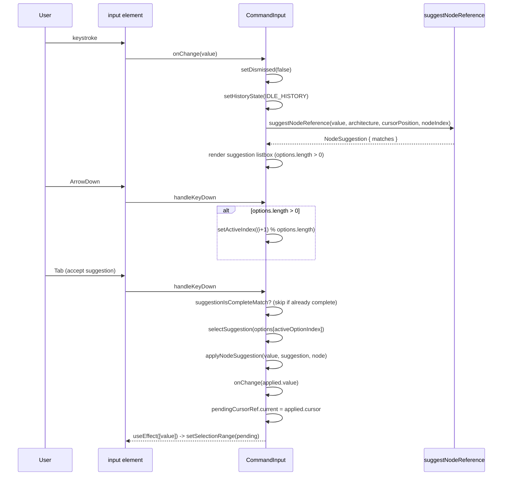
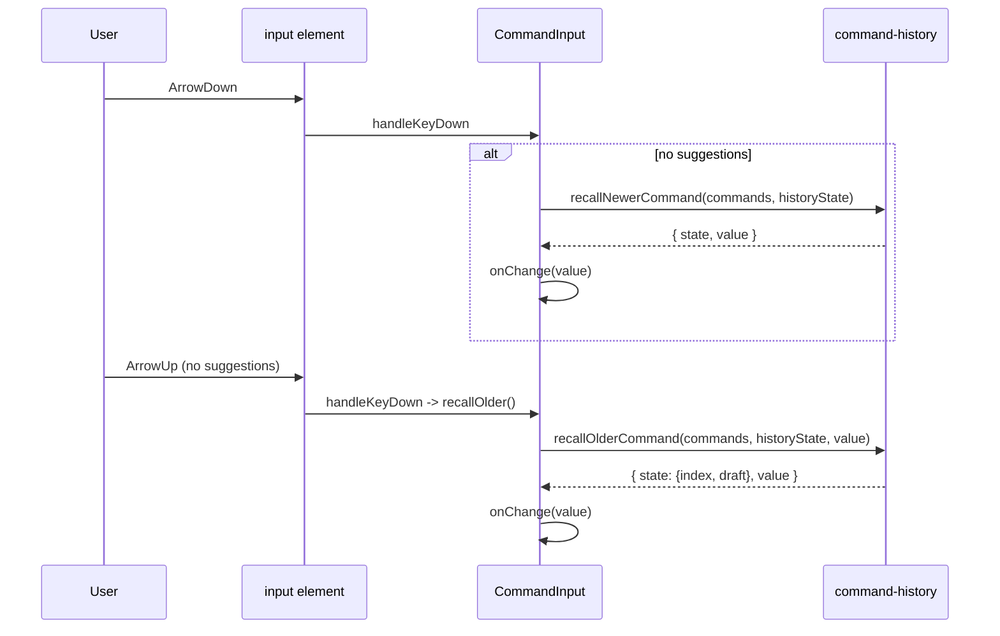

# Command input (autocomplete + Up/Down recall)

`handleKeyDown` checks whether `suggestNodeReference`'s suggestion list is non-empty first, routing Up/Down/Enter/Tab to suggestion navigation whenever suggestions exist and only falling through to `recallOlderCommand`/`recallNewerCommand` once that list is empty, so suggestions fully shadow history recall.

**Source:** `src/components/command-input.tsx:1-263`

**Autocomplete suggestion flow**

**History recall flow**

