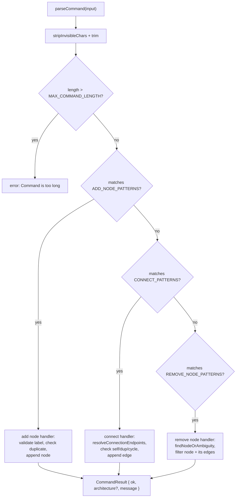
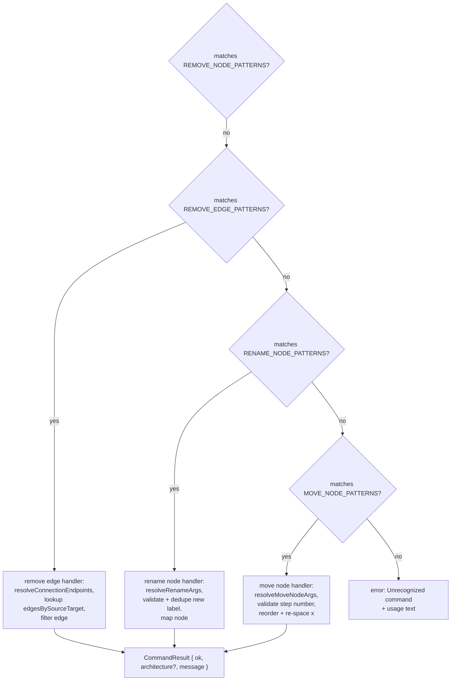

# Command parser entry point (all 6 verbs)

`parseCommand` is the single entry point every typed command passes through. It strips invisible characters and trims the input, rejects anything over `MAX_COMMAND_LENGTH`, then tries each verb's regex pattern list in a fixed order via `matchFirst`: add node, connect, remove node, remove edge, rename node, move node. The first pattern that matches wins and its branch runs to completion (validating labels/nodes, checking for duplicates, cycles, or out-of-range steps) and returns a `CommandResult` immediately, so branches are mutually exclusive and later patterns never see input matched earlier. If none of the six pattern lists match, the function falls through to a single `Unrecognized command` result listing usage.

**Source:** `src/lib/architecture-commands.ts:425-731`

**Trim, length guard, and the add/connect/remove-node branches**

**Remove-edge/rename/move-node branches and the fallback**

A subtle detail the diagram surfaces: the checks are strictly sequential and short-circuiting, so a string could textually match a later verb's pattern too, but it is only ever tested against that later pattern if every earlier verb's pattern already failed to match.
