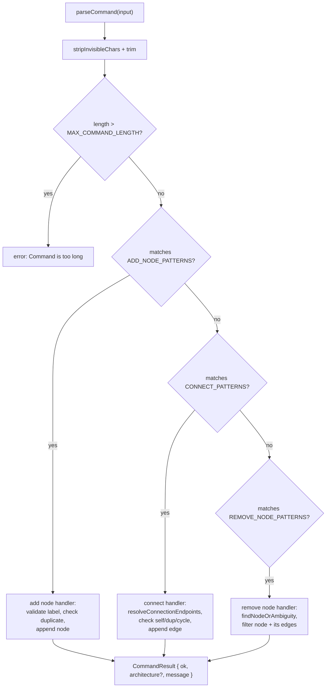
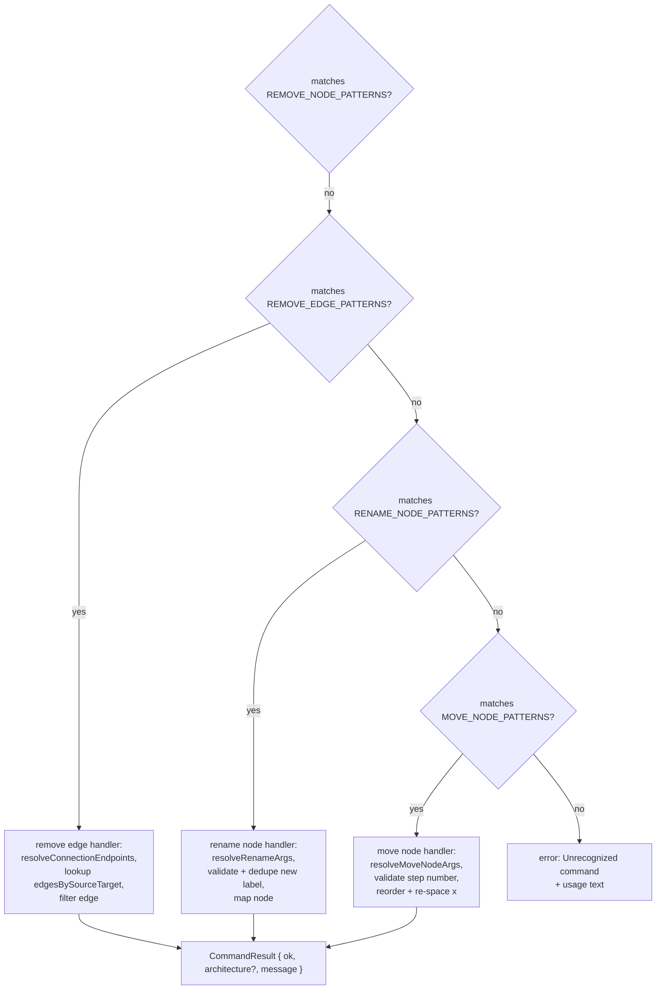

# Command parser entry point (all 6 verbs)

`parseCommand` strips invisible characters, trims, rejects input over `MAX_COMMAND_LENGTH`, then tests each verb's regex patterns in a fixed, short-circuiting order via `matchFirst`, so the first matching verb's branch runs while later verbs are never tested.

**Source:** `src/lib/architecture-commands.ts:88-394`

**Trim, length guard, and the add/connect/remove-node branches**

**Remove-edge/rename/move-node branches and the fallback**

