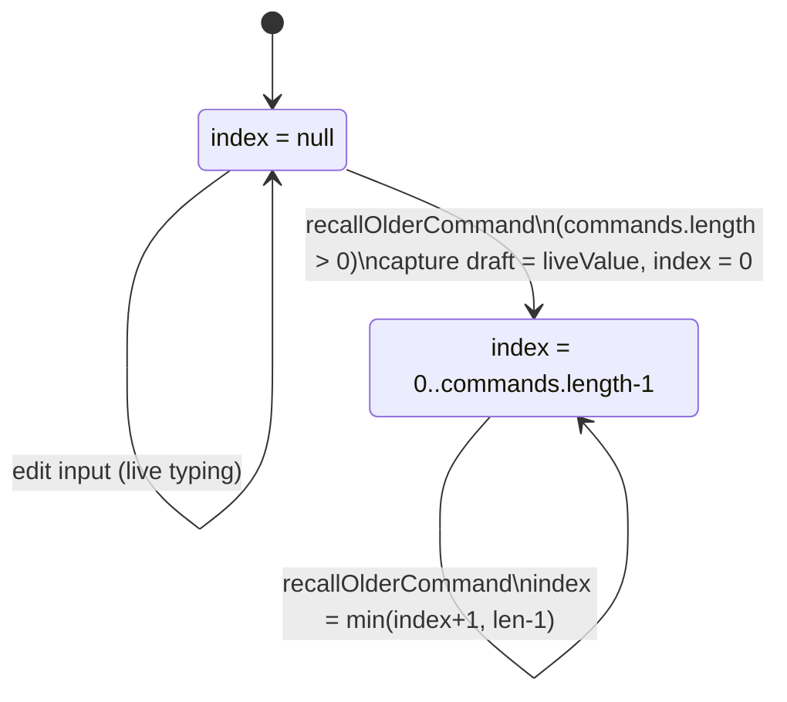
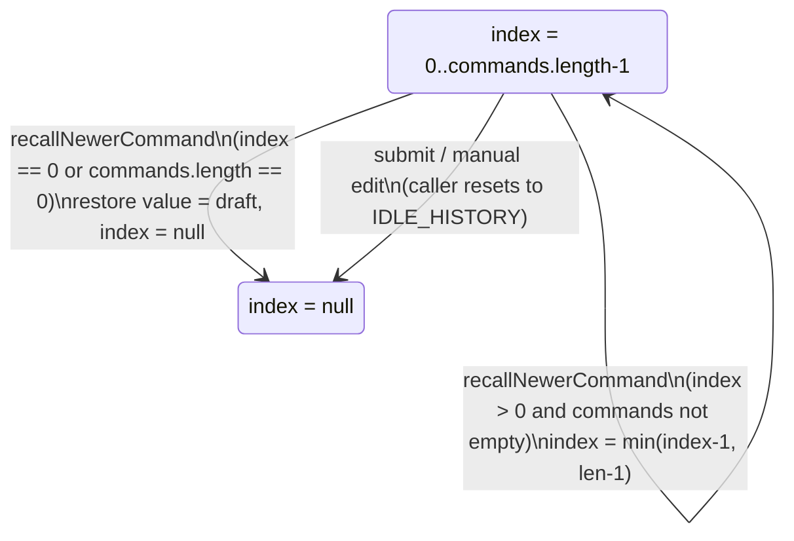

# Command recall (Up/Down, not undo)

`recallOlderCommand` and `recallNewerCommand` implement shell-style history navigation over previously submitted console commands, kept deliberately separate from any undo/redo of graph edits. State is a single `{ index, draft }` pair: `index` is `null` while live-editing or an offset into `commands` counting back from the most recent entry, and `draft` freezes the in-progress input the moment recall starts so it can be restored when the user arrows back past the newest history entry. Both functions are pure -- they take the current `commands` array and `state` and return a new `state` plus the `value` to display, leaving the caller (`command-input.tsx`) responsible for applying it and for resetting to the idle state on submit or on manual edits. `recallNewerCommand` also guards against `commands` having shrunk or emptied since recall began, clamping the index rather than indexing out of bounds.

**Source:** `src/lib/command-history.ts:1-64`

**Entering recall and paging older**

**Paging newer and exiting recall**

The state machine makes explicit that pressing Down at the oldest end of a fresh recall does not just decrement -- it exits recall entirely and hands back the frozen `draft`, mirroring how a shell restores your unsent line after arrowing past it.
