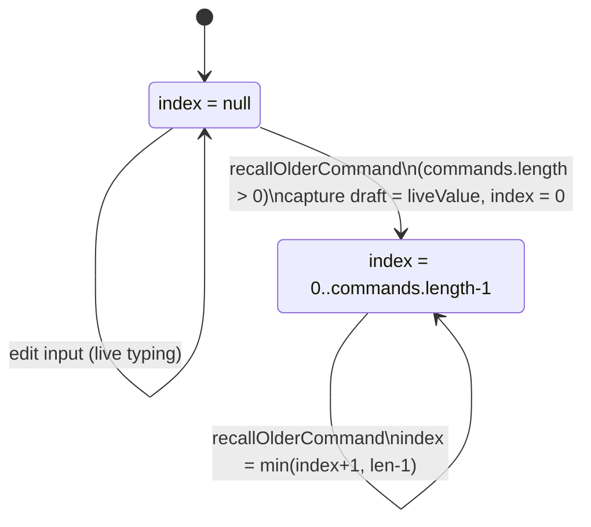
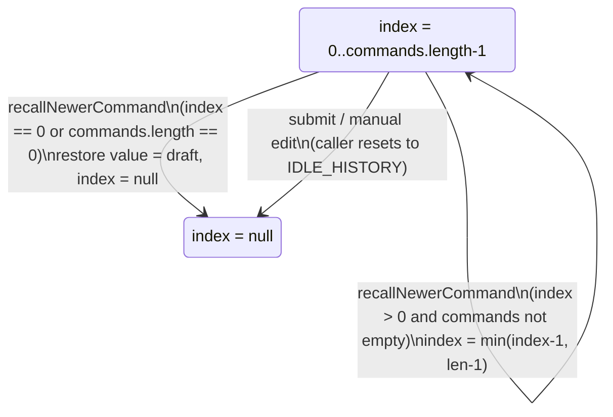

# Command recall (Up/Down, not undo)

`recallNewerCommand` exits recall, resetting `index` to `null` and restoring the frozen `draft`, rather than merely decrementing, once `index` reaches 0 or `commands` empties — mirroring how a shell restores an unsent line after arrowing past it.

**Source:** `src/lib/command-history.ts:1-50`

**Entering recall and paging older**

**Paging newer and exiting recall**

