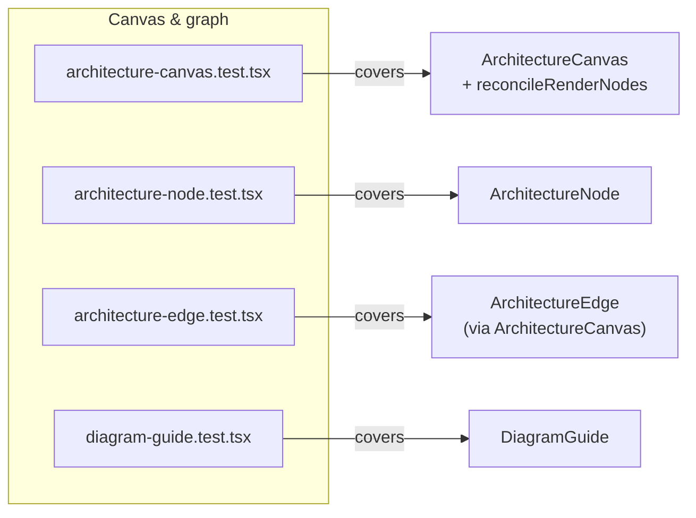
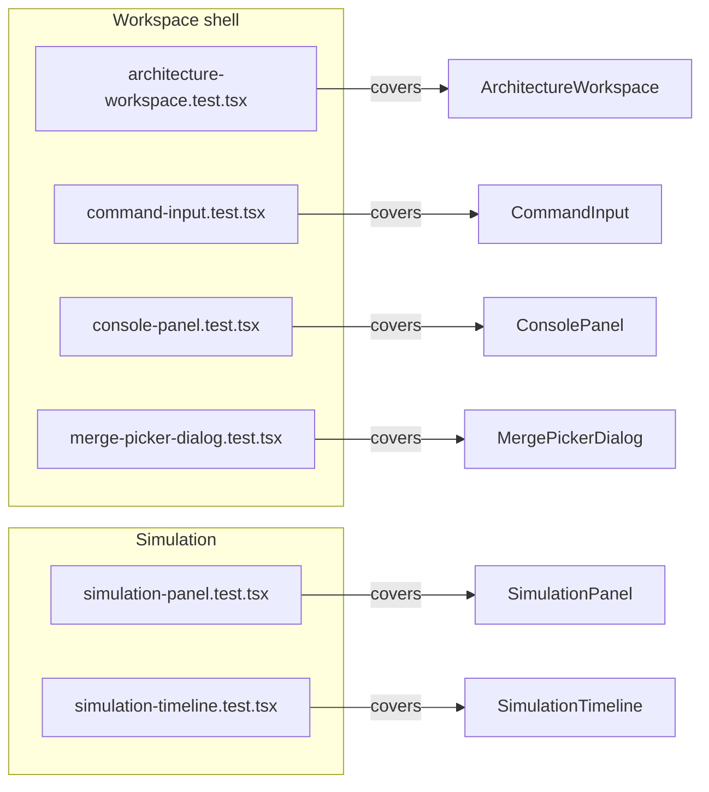

# Component tests

`src/components/test/` holds one Vitest spec per component in `src/components/`, each
declaring `// @vitest-environment jsdom` and rendering with React Testing Library. Components
are exercised as pure, callback-driven units: tests build props with `vi.fn()` mocks (e.g.
`onNodeCreate`, `onNodeRename`, `onEdgeDelete` in `architecture-canvas.test.tsx`) and assert
on both rendered output and which mock was called with what arguments, rather than reaching
into implementation details. Each file's `describe` blocks are grouped by user-facing
behavior (typing, suggestions, history recall, submitting) instead of by internal function,
so the test names double as a behavior checklist for the component.

**Source:** `src/components/test/`

**Canvas & graph test coverage**

**Workspace shell & simulation test coverage**

One subtlety the diagram surfaces: `architecture-edge.test.tsx` does not import
`ArchitectureEdge` directly — it renders `ArchitectureCanvas` and asserts on the edges React
Flow produces, since edge rendering only makes sense inside a live canvas/provider context.
