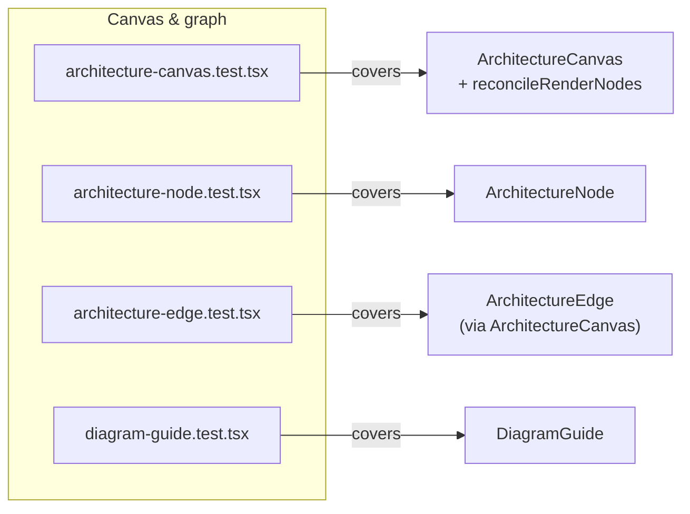
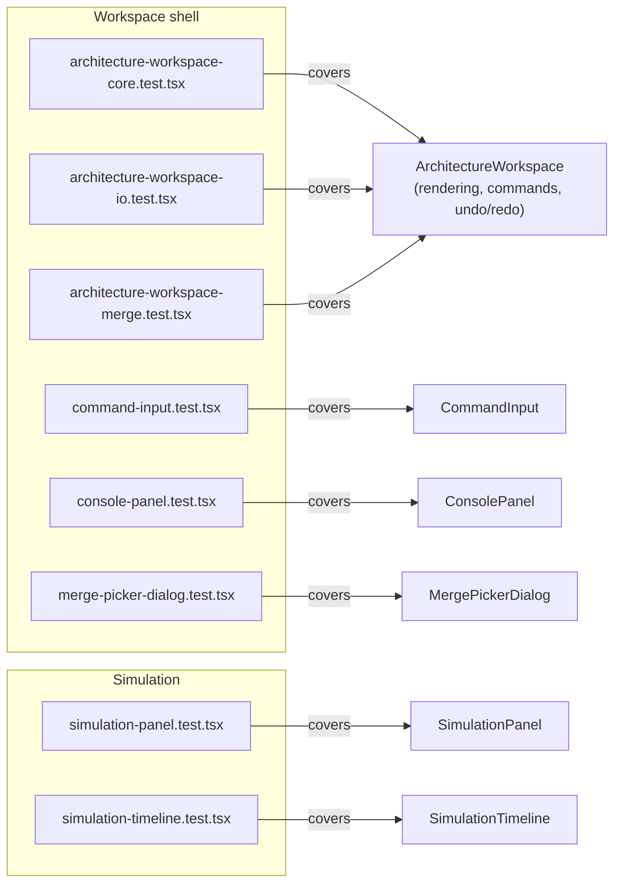

# Component tests

Each spec in `src/components/test/` renders its component with React Testing Library under `// @vitest-environment jsdom`, then asserts on rendered output and `vi.fn()` mock callback invocations rather than internal component state.

**Source:** `src/components/test/`

**Canvas & graph test coverage**

**Workspace shell & simulation test coverage**

