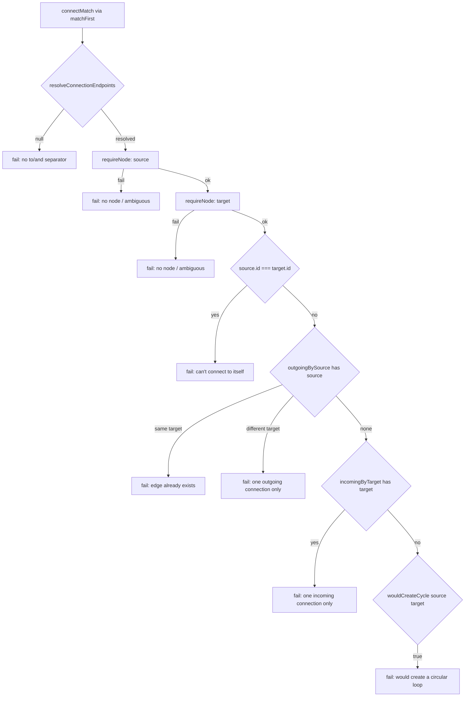
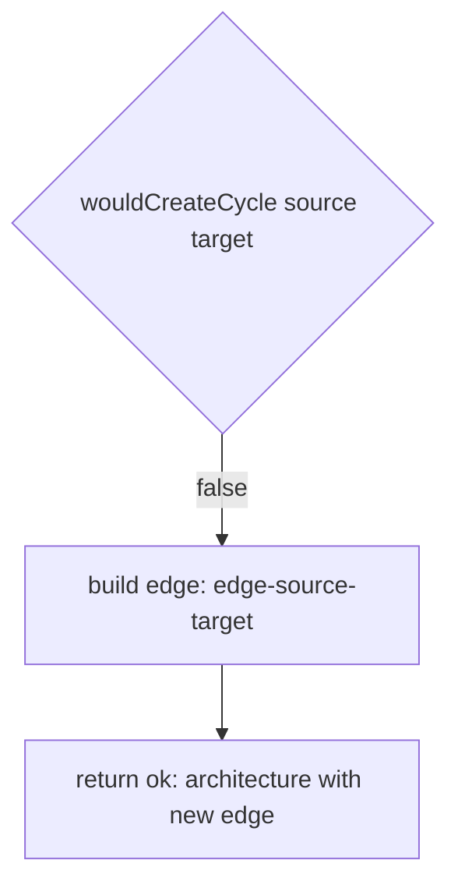

# `connect` (add edge)

Because the one-outgoing/one-incoming constraint already keeps the graph a simple chain, `wouldCreateCycle` only needs to catch the edge case where the new edge closes that chain back on itself.

**Source:** `src/lib/architecture-commands.ts:139-211`

**Endpoint resolution and guard checks**

**Edge construction and result**

