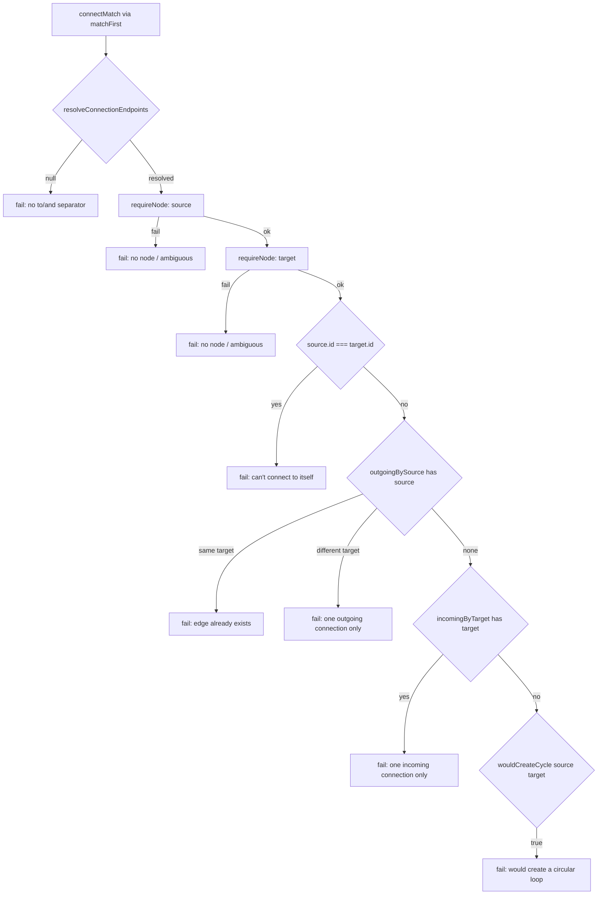
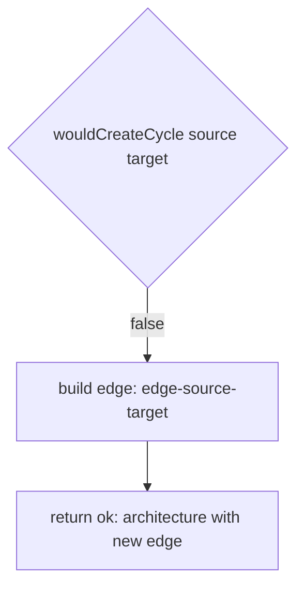

# `connect` (add edge)

This slice handles the `connect <A> to <B>` command: it resolves both endpoint labels via `resolveConnectionEndpoints`/`requireNode`, then runs a sequence of guard checks — self-loop, an existing outgoing edge on the source, an existing incoming edge on the target, and a cycle check via `wouldCreateCycle` — before appending a new edge. The one-outgoing/one-incoming constraint keeps the architecture graph a simple chain (matching the simulation player's step-by-step model), and `wouldCreateCycle` walks forward from the target through `outgoingBySource` looking for a path back to the source, which also guards against runaway loops since the chain is otherwise singly-linked. Each failure path returns a specific, user-facing message rather than a generic error, reusing the already-resolved node labels for readability.

**Source:** `src/lib/architecture-commands.ts:680-752`

**Endpoint resolution and guard checks**

**Edge construction and result**

The outgoing/incoming checks run before the cycle check, so on a graph that is already a simple chain, `wouldCreateCycle` only ever needs to catch the case where the new edge closes the chain back on itself.
