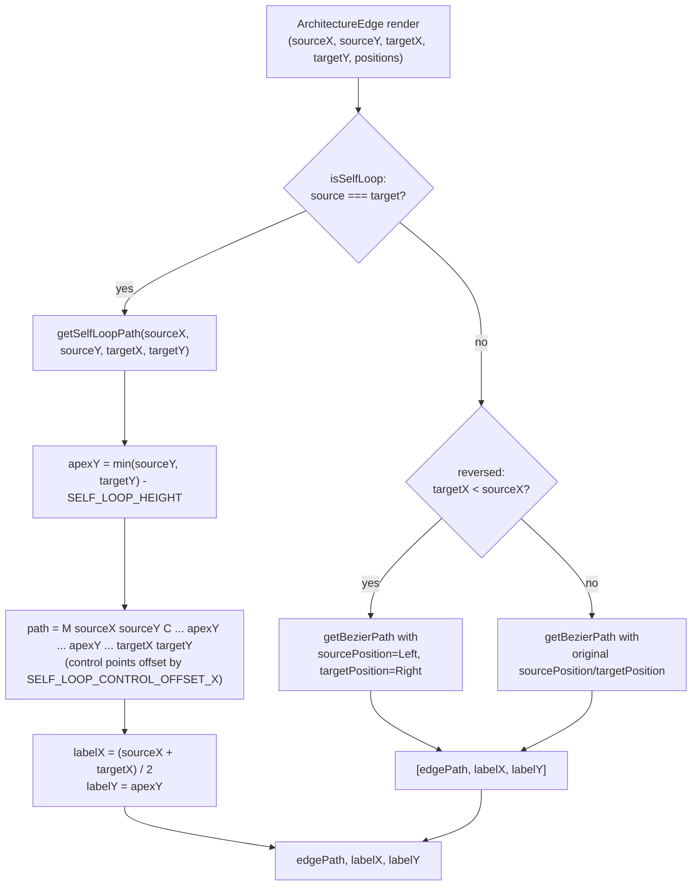
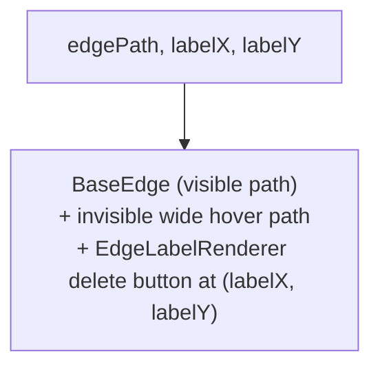

# Custom edge (self-loop path)

`ArchitectureEdge` detects `source === target` and hand-computes a self-loop path via `getSelfLoopPath`, placing the curve's apex above both endpoints at `min(sourceY, targetY) - SELF_LOOP_HEIGHT`, with control points offset horizontally by `SELF_LOOP_CONTROL_OFFSET_X`.

**Source:** `src/components/architecture-edge.tsx:1-120`

**Path computation: self-loop vs. bezier fork**

**Unified edge rendering**

