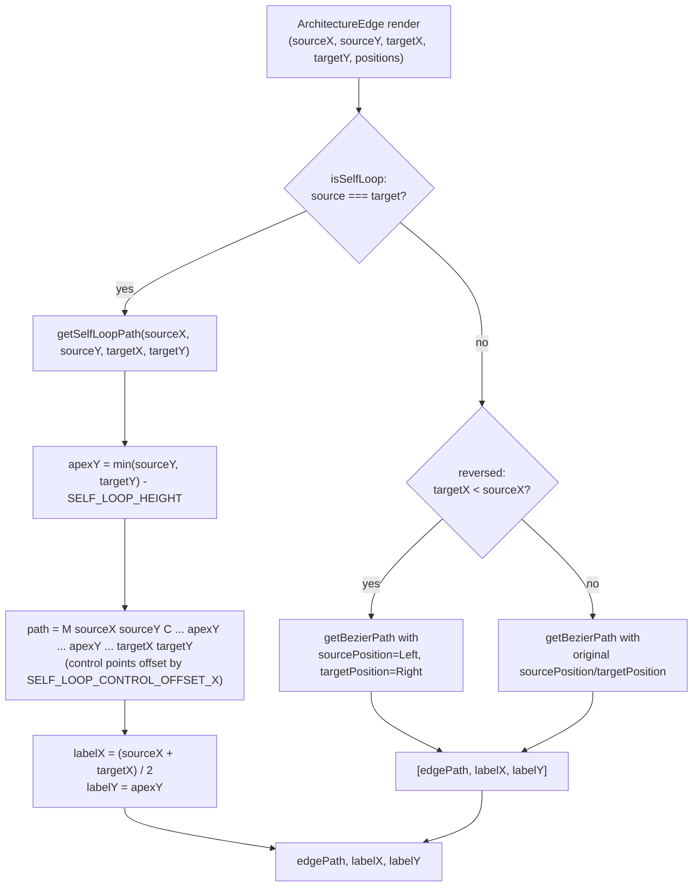
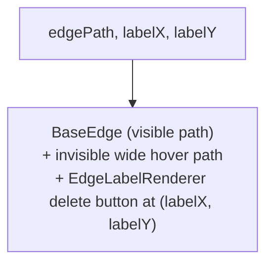

# Custom edge (self-loop path)

`ArchitectureEdge` is a custom React Flow edge renderer. Because a standard bezier path degenerates
when an edge's source and target are the same node, the component checks `source === target` and, for
self-loops, computes a path by hand: `getSelfLoopPath` raises an apex above both endpoints
(`Math.min(sourceY, targetY) - SELF_LOOP_HEIGHT`) and builds a cubic bezier `M ... C ...` string whose
two control points sit at that apex, offset left/right by `SELF_LOOP_CONTROL_OFFSET_X`. For ordinary
edges it falls back to React Flow's `getBezierPath`, additionally flipping `sourcePosition`/
`targetPosition` to `Left`/`Right` when `targetX < sourceX` so the curve doesn't loop backward when the
target node sits to the left of the source. Both branches yield the same `[path, labelX, labelY]` tuple,
which feeds the visible `BaseEdge`, a wider invisible hover path, and a hover/focus-revealed delete
button rendered via `EdgeLabelRenderer`.

**Source:** `src/components/architecture-edge.tsx:1-107`

**Path computation: self-loop vs. bezier fork**

**Unified edge rendering**

The self-loop branch and the ordinary branch both terminate in the same `[path, labelX, labelY]`
shape, which is why the render path below the fork stays a single, un-duplicated flow.
