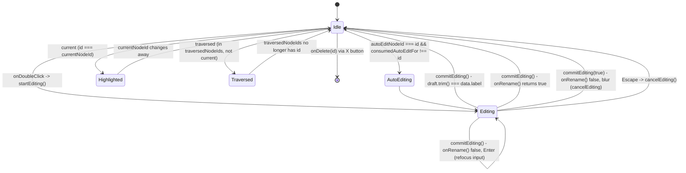

# Custom node (rename/delete/highlight)

`ArchitectureNode` is the React Flow node renderer: it reads `HighlightedNodeContext` to decide whether it is the simulation's `current` step or already `traversed`, and reads `NodeActionsContext` for the mouse-driven `onRename`/`onDelete` callbacks wired up by `ArchitectureCanvas`. Editing is local `isEditing`/`draft` state entered via double-click (`startEditing`) or, for a freshly created node, automatically the first render its id matches `autoEditNodeId` (guarded by `consumedAutoEditFor` so it fires once, with `onAutoEditConsumed` telling the canvas the hand-off is done). `commitEditing` trims the draft, treats an unchanged value as a no-op close, and otherwise calls `onRename`; on rejection it either cancels (blur, a low-commitment gesture) or refocuses the input to let the user fix the invalid text (Enter, an explicit retry), per the comment at lines 80-86. The delete button is an `X` that only becomes visible via `group-hover`/`focus-visible` and stops propagation so it doesn't also trigger canvas drag/select handling.

**Source:** `src/components/architecture-node.tsx:1-173`

The diagram makes visible that "highlighted" and "editing" are not mutually exclusive states in the code -- `current`/`traversed` come from context and are computed every render regardless of `isEditing`, so a node mid-rename can simultaneously carry the current-step border styling while its label is replaced by the `<input>`.
