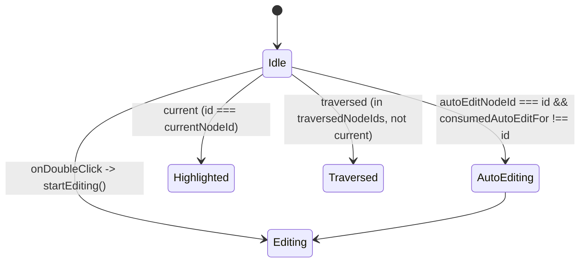
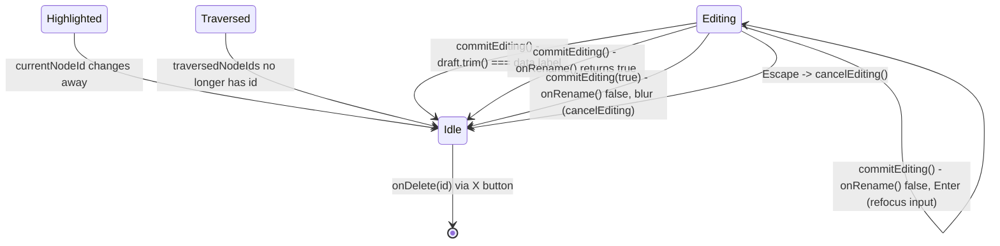

# Custom node (rename/delete/highlight)

`ArchitectureNode` reads `HighlightedNodeContext` and `NodeActionsContext` independently every render, so a node mid-rename can simultaneously carry the current-step highlight border while its label is replaced by the editing `<input>`.

**Source:** `src/components/architecture-node.tsx:1-180`

**Entering edit, highlight, and traversal states**

**Exiting, resetting, and side transitions**

