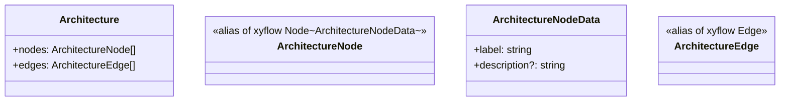
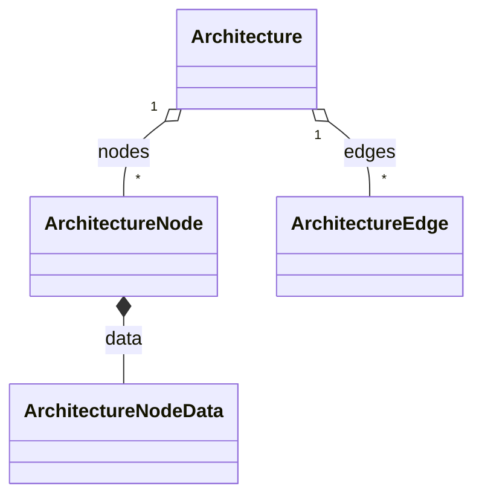

# Data model (React Flow-compatible types)

`ArchitectureNode` and `ArchitectureEdge` are direct aliases of `@xyflow/react`'s `Node<ArchitectureNodeData>` and `Edge`, so the only app-specific addition is `ArchitectureNodeData`'s optional `description`, embedding each node's simulation narrative directly in `data` instead of a separate parallel structure.

**Source:** `src/types/architecture.ts:1-32`

**Type definitions**

**Containment relationships**

