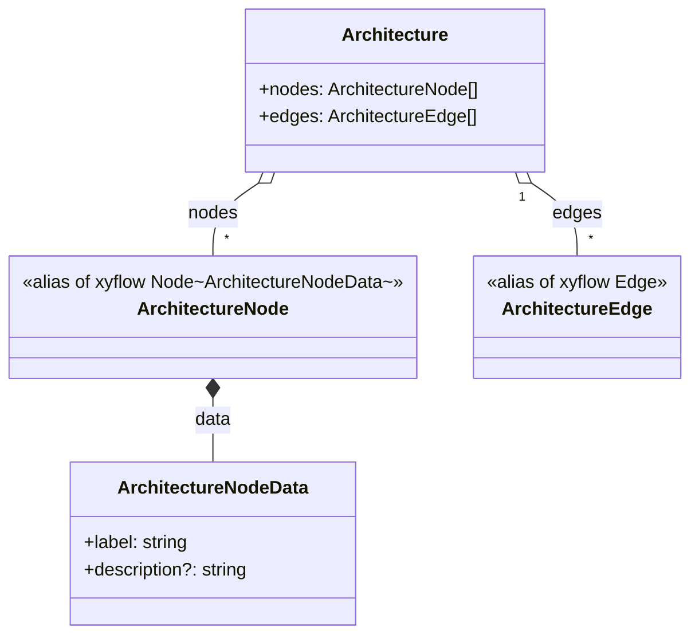

# Data model (React Flow-compatible types)

`Architecture` is the whole-graph container: a plain `{ nodes, edges }` pair matching the props shape React Flow's `<ReactFlow>` expects. `ArchitectureNode` is not a custom type but a direct alias of `@xyflow/react`'s generic `Node`, parameterized with `ArchitectureNodeData` — so every node automatically carries React Flow's built-in fields (id, position, etc.) plus this app's own `data` payload, with nothing redefined. `ArchitectureNodeData` is deliberately minimal: a required `label` and an optional `description`, the latter commented as the "simulation narrative for this node's step" — so a node's playback text lives on the node itself rather than in a separate parallel lookup. `ArchitectureEdge` is a bare, unextended alias of React Flow's `Edge`, since edges need no app-specific data.

**Source:** `src/types/architecture.ts:1-16`

The diagram's one non-obvious point: `description` is optional and lives inside the node's own `data`, not in a sibling `simulation` structure — the simulation trace is embedded per-node rather than tracked as a separate parallel array keyed by node id.
