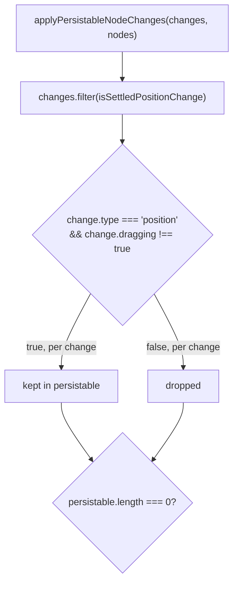
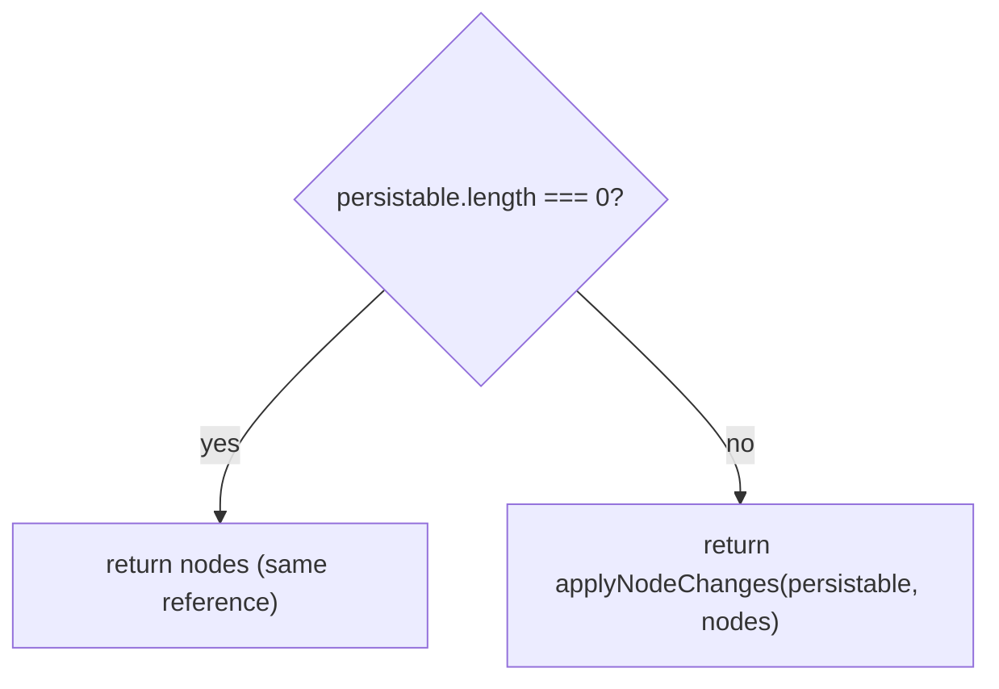

# Drag-position autosave-spam fix

`applyPersistableNodeChanges` filters React Flow's per-frame `position` `NodeChange` events down to those where `dragging !== true`, returning the original `nodes` array by reference when none survive so `architecture-canvas.tsx` skips firing autosave on every in-drag frame.

**Source:** `src/lib/node-changes.ts:1-26`

**Filtering settled position changes**

**Returning the reference or the merged result**

