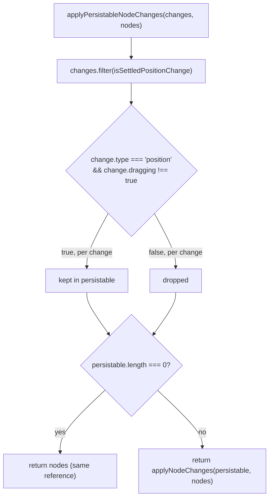

# Drag-position autosave-spam fix

React Flow emits a `position`-type `NodeChange` on every pointer-move frame of a drag, not just when the drag ends, so passing all changes straight through to the persisted `architecture.nodes` store would trigger a save on every frame. `applyPersistableNodeChanges` filters the incoming changes down to only `position` changes where `dragging !== true` (i.e. the change that fires once the drag settles), then hands that filtered list to React Flow's `applyNodeChanges`. If nothing survives the filter, it returns the original `nodes` array by reference instead of calling `applyNodeChanges`, so the caller can cheaply skip persisting via a `!==` check.

**Source:** `src/lib/node-changes.ts:1-20`

The reference-equality return in the empty-filter branch is what lets the caller in `architecture-canvas.tsx` (`if (nextNodes !== architecture.nodes) onNodesChange(nextNodes)`) skip firing a persist/autosave call on every in-drag frame, since only a settled drag produces a new array.
