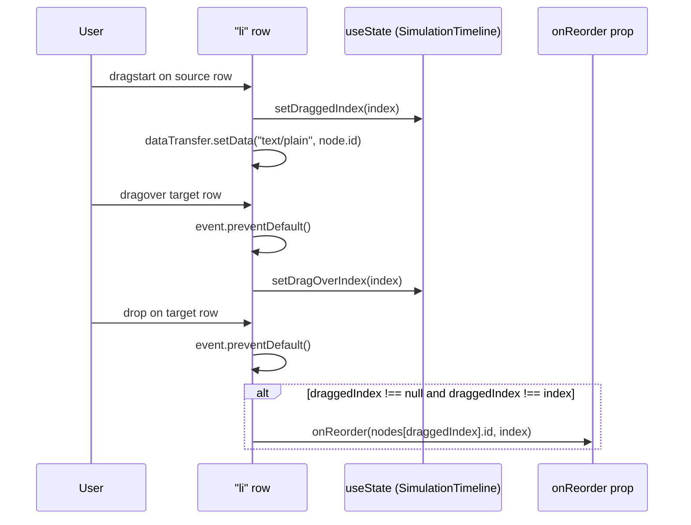
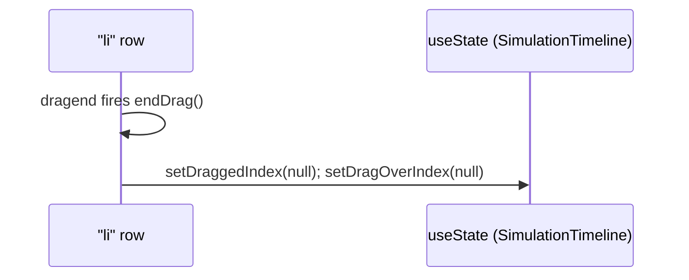

# Drag-to-reorder steps

`SimulationTimeline` renders each node as a `draggable` `<li>` and tracks only two pieces of local state, `draggedIndex` and `dragOverIndex`, to drive the drag interaction — no library is used. `onDragOver` calls `event.preventDefault()` so the row becomes a valid drop target, and the CSS class on each row reads `dragOverIndex`/`draggedIndex` to show a top border on the hovered row and dim the row being dragged. `onDrop` only invokes `onReorder` when `draggedIndex !== null && draggedIndex !== index`, so dropping a row on itself (or a stray drop with nothing tracked) is a no-op; `onDragEnd` always resets both indices via `endDrag()` regardless of whether a drop occurred, so an aborted drag (e.g. Escape) still clears the highlight. The same `onReorder(node.id, index ± 1)` callback also backs the up/down chevron buttons, giving keyboard/click users an equivalent, drag-free path to the same reorder.

**Source:** `src/components/simulation-timeline.tsx:1-126`

**Drag start, hover, and drop**

**Drag-end cleanup**

The diagram makes it visible that `endDrag()` runs unconditionally on `dragend`, outside the `alt` branch — so a drag that never triggers `onReorder` (dropped on itself, or cancelled) still clears the highlight state, preventing a stuck drag-over border.
