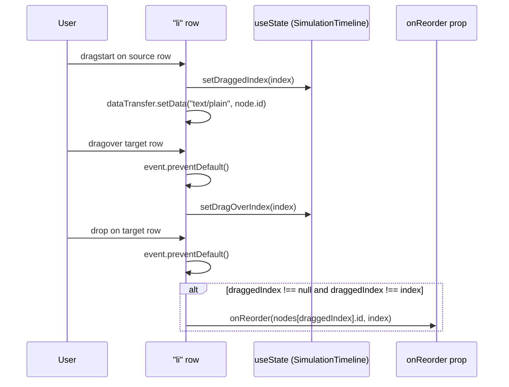
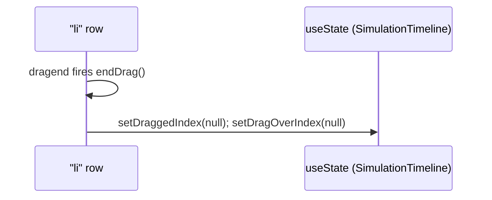

# Drag-to-reorder steps

`SimulationTimeline` drives native drag-to-reorder with two `useState` values, `draggedIndex` and `dragOverIndex`, calling `onReorder(node.id, index)` from `onDrop` only when `draggedIndex !== null && draggedIndex !== index`, while `onDragEnd` always resets both indices via `endDrag()`.

**Source:** `src/components/simulation-timeline.tsx:1-137`

**Drag start, hover, and drop**

**Drag-end cleanup**

