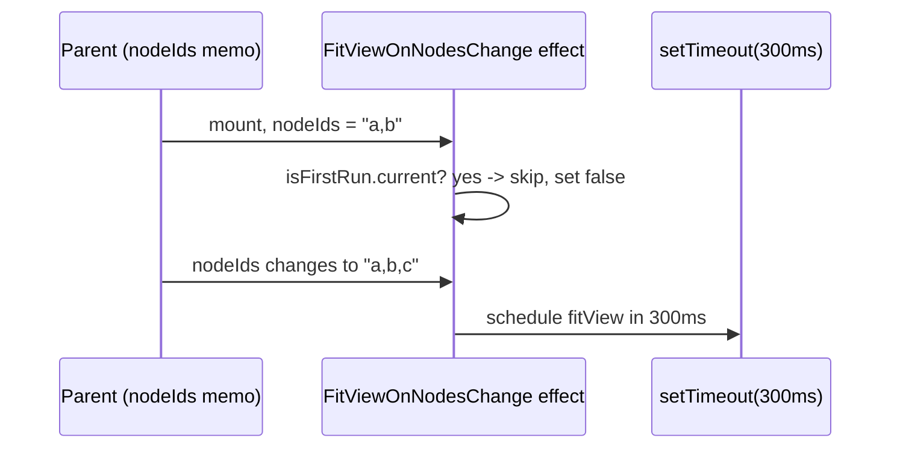
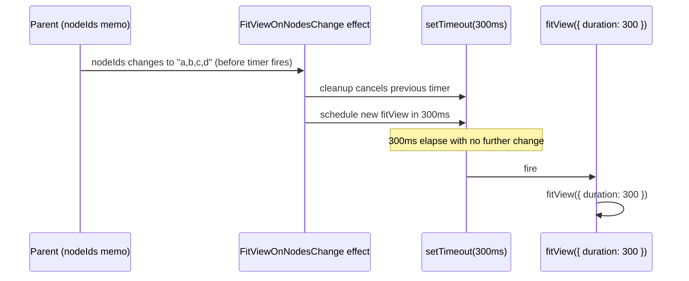

# `fitView` Debounce

`FitViewOnNodesChange` watches a memoized `nodeIds` string and schedules `fitView({ duration: 300 })` in a `setTimeout` whose cleanup cancels any pending timer, collapsing bursts of node mutations into one animated fit 300ms after the last change settles.

**Source:** `src/components/architecture-canvas.tsx:154-189`

**Mount skip and first scheduled fit**

**Reschedule on a rapid second change, then fire**

