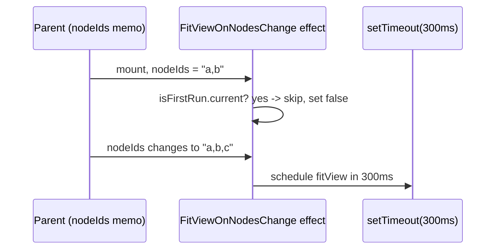
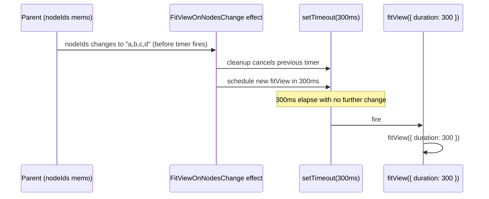

# `fitView` Debounce

React Flow's `fitView` prop on `<ReactFlow>` only runs once, at mount, so it cannot re-center the camera as nodes are added or removed later. `FitViewOnNodesChange` fills that gap: it watches a `nodeIds` string (the joined ids of `architecture.nodes`, memoized in the parent) and, on every change after the first, schedules `fitView({ duration: 300 })` inside a 300ms `setTimeout`. The effect's cleanup clears that timer before each re-run, so if `nodeIds` changes again within the 300ms window the pending call is cancelled and a fresh one is scheduled — collapsing a burst of rapid mutations into a single animated fit. A `isFirstRun` ref skips the effect's first invocation so this logic never fights the initial `fitView` mount behavior.

**Source:** `src/components/architecture-canvas.tsx:154-189`

**Mount skip and first scheduled fit**

**Reschedule on a rapid second change, then fire**

The single cleanup-then-reschedule pattern means the component never holds more than one pending timer at a time, so an arbitrarily long burst of edits still produces exactly one `fitView` call, fired 300ms after the last change settles.
