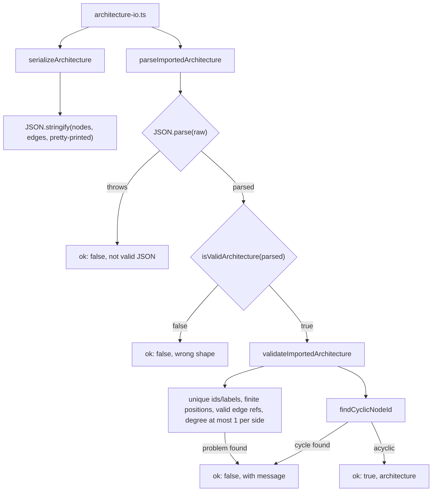
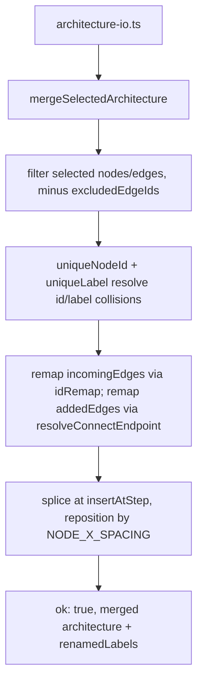

# Import / export / merge

This slice implements the three ways an `Architecture` crosses a file/JSON boundary. `serializeArchitecture` pretty-prints `{ nodes, edges }` with 2-space indentation specifically so a downloaded file is readable if a reviewer opens it directly. `parseImportedArchitecture` treats imported JSON as untrusted: it parses, runs the structural type guard `isValidArchitecture`, then `validateImportedArchitecture` re-checks invariants the rest of the app assumes already hold (unique ids/labels, finite positions, edges that reference real nodes, at most one outgoing and one incoming edge per node) and rejects cycles via `findCyclicNodeId`, a topological walk starting from in-degree-zero nodes. `mergeSelectedArchitecture` folds a chosen subset of a second architecture into the current one, deconflicting ids (`uniqueNodeId`) and labels (`uniqueLabel`) against the current graph, remapping both the incoming edges and any manually added connect edges through that same id remap, then splicing the result into `current.nodes` at `insertAtStep` and repositioning only the spliced-in and trailing nodes by `NODE_X_SPACING`.

**Source:** `src/lib/architecture-io.ts:20-348`

**Serialize and validate on import**

**Merge a selected subset into the current architecture**

One detail the diagram makes visible: `validateImportedArchitecture` and `mergeSelectedArchitecture` share the same folded-label uniqueness rule (`foldLabel`), but they respond to a collision differently — import rejects the whole file, while merge silently renames the incoming node and records it in `renamedLabels`.
