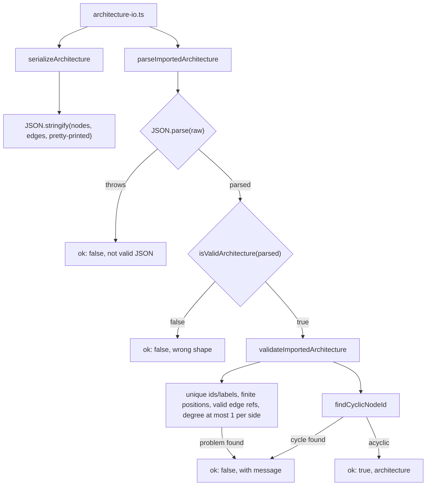
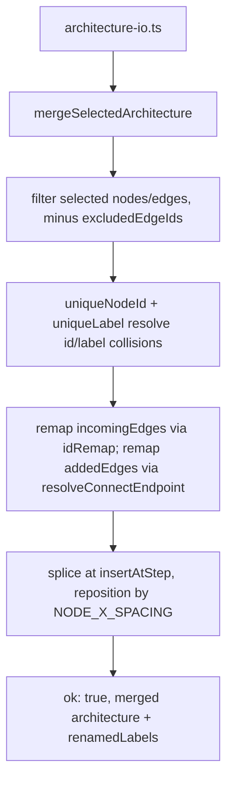

# Import / export / merge

`validateImportedArchitecture` and `mergeSelectedArchitecture` both enforce label uniqueness via `foldLabel`, but import rejects the whole file on a collision while merge silently renames the incoming node and records it in `renamedLabels`.

**Source:** `src/lib/architecture-io.ts:23-407`

**Serialize and validate on import**

**Merge a selected subset into the current architecture**

