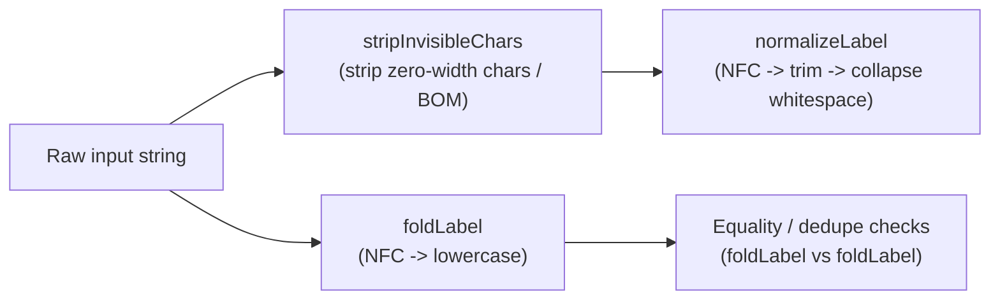
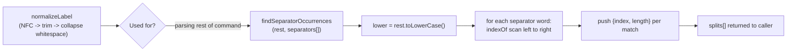

# Regex fragments & label normalization

`findSeparatorOccurrences` does its own lowercasing rather than reusing `foldLabel`, and skips whitespace/invisible-character normalization entirely, scanning only the already-normalized `rest` argument and leaving callers responsible for running `normalizeLabel` first.

**Source:** `src/lib/node-reference.ts:1-165`

**Normalizing and folding labels**

**Scanning a normalized label for separator words**

