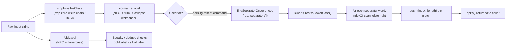

# Regex fragments & label normalization

This file holds the small text-cleanup and pattern-matching primitives shared by the command parser and the suggestion engine. `stripInvisibleChars` removes zero-width space/joiner characters and a BOM that would otherwise make two visually identical labels compare as different. `normalizeLabel` builds on that: it applies Unicode NFC normalization, strips invisible characters, trims, and collapses internal whitespace runs, producing the canonical display form of a label. `foldLabel` is a cheaper variant used purely for equality checks (NFC + lowercase, no whitespace collapsing). `findSeparatorOccurrences` then scans a lowercased string for every occurrence of every separator word (e.g. `" to "`, `" and "`) so callers like the rename/connect parsers can split `"A to B"` on the right word boundary.

**Source:** `src/lib/node-reference.ts:1-75`

`findSeparatorOccurrences` does its own lowercasing rather than reusing `foldLabel`, and it deliberately does not normalize whitespace or invisible characters -- it only compares against the raw, already-normalized `rest` argument, so callers are responsible for running `normalizeLabel` first.
