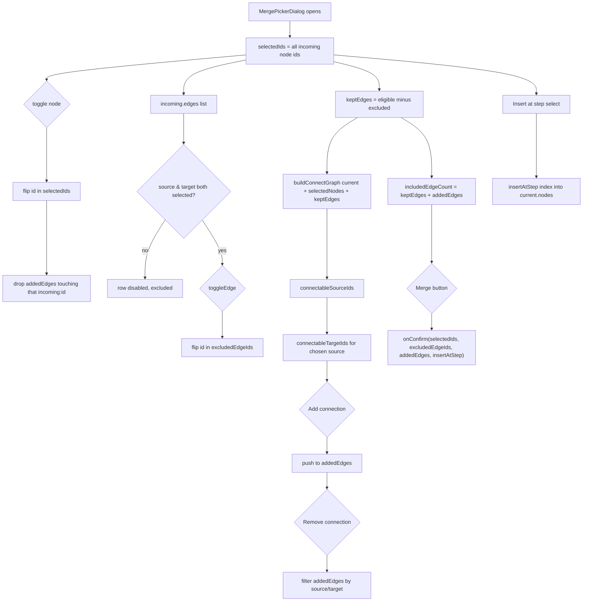

# Merge picker dialog

This dialog lets a user selectively merge an uploaded file's architecture into the current one: pick which incoming nodes to keep, drop individual incoming edges, splice extra connections between the two graphs, and choose where in the current step sequence the merged nodes land. It reuses the `connect` command's own graph-building helpers (`buildConnectGraph`, `connectableSourceIds`/`connectableTargetIds`, namespaced via `connectOptionKey`/`decodeConnectOptionKey`) so the "Connect" control enforces the same one-outgoing/one-incoming/no-cycle rules as typed commands, instead of re-deriving that logic. Deselecting a node also silently drops any added connection touching it, and `foldLabel` is used only to warn (not block) when an incoming node's label will collide with an existing one and get renamed on merge. State is local `useState`; the parent owns the actual merge via `onConfirm(selectedIds, excludedEdgeIds, addedEdges, insertAtStep)`.

**Source:** `src/components/merge-picker-dialog.tsx:1-458`

One subtlety the diagram surfaces: the source/target selects for a new connection are recomputed from `connectGraph` on every render rather than stored as committed choices, so `effectiveSource`/`effectiveTarget` fall back to the first still-valid option whenever a prior selection is toggled out of eligibility.
