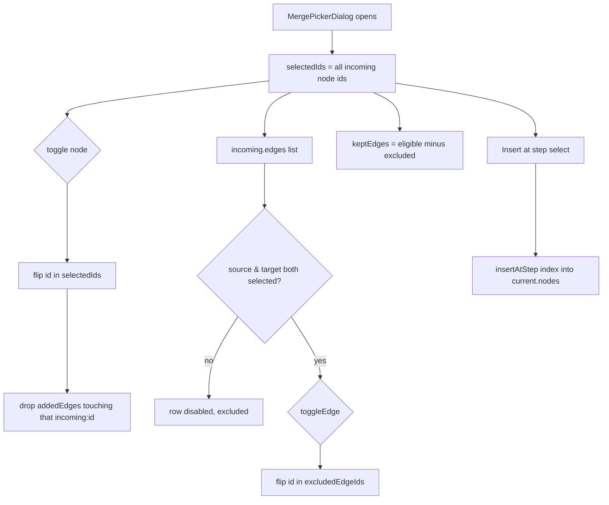
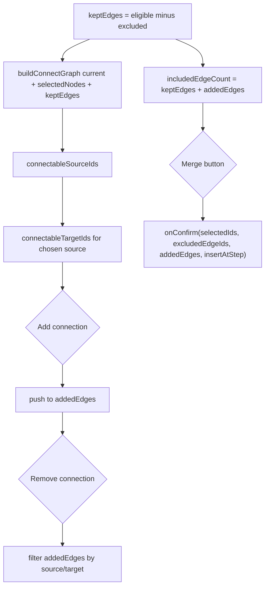

# Merge picker dialog

Because `effectiveSource`/`effectiveTarget` are recomputed from `connectGraph` on every render rather than stored as committed choices, they silently fall back to the first still-valid option whenever a prior selection is toggled out of eligibility.

**Source:** `src/components/merge-picker-dialog.tsx:1-542`

**Node, edge & step selection**

**Connect-graph construction and merge**

