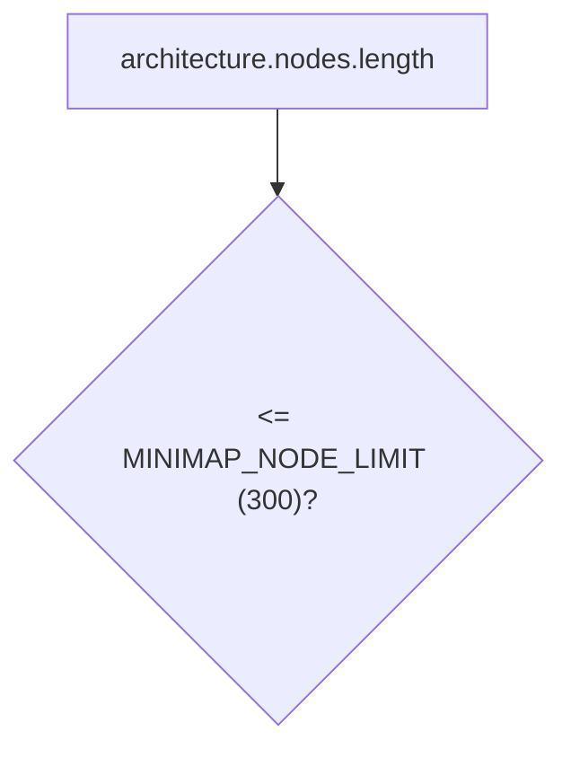
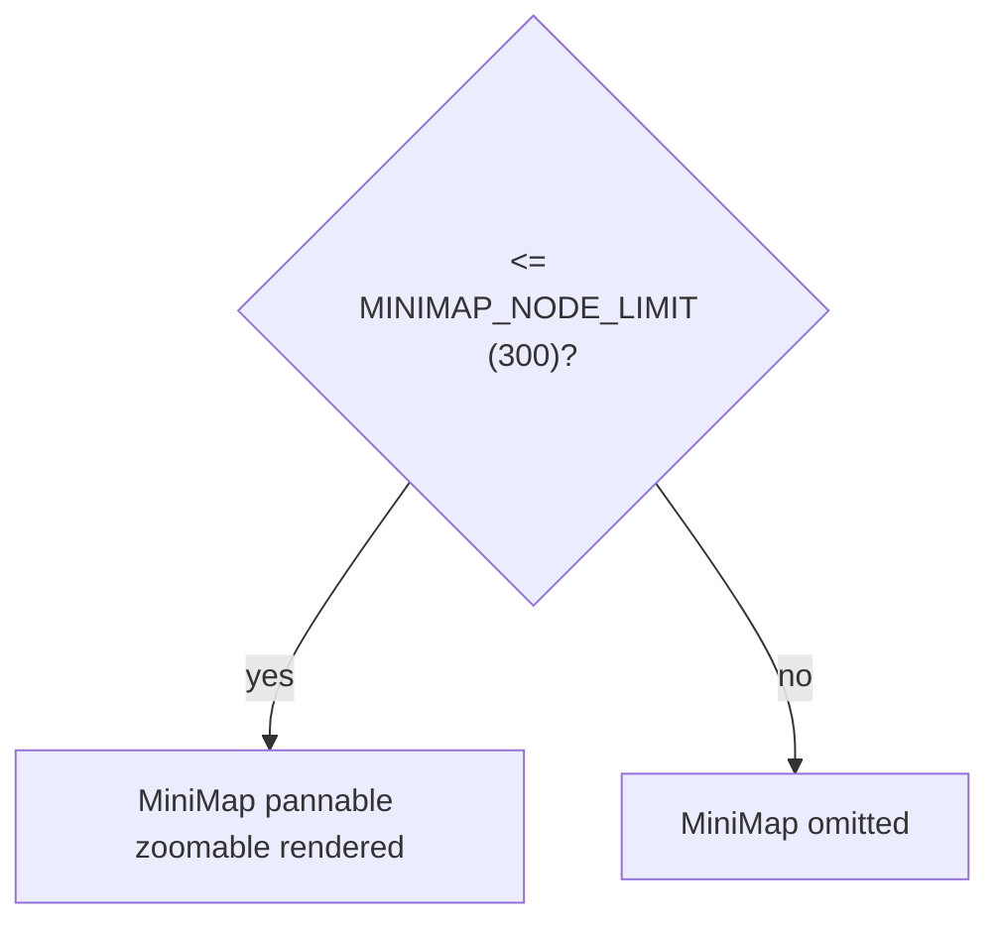

# MiniMap node-count guard

`MINIMAP_NODE_LIMIT` (300) gates whether `<MiniMap pannable zoomable />` renders inside `<ReactFlow>`, since the minimap redraws every node's position on each mutation, dominating render cost at scale unlike the main canvas.

**Source:** `src/components/architecture-canvas.tsx:152,346-356`

**Node-count guard check**

**Minimap render outcome**

