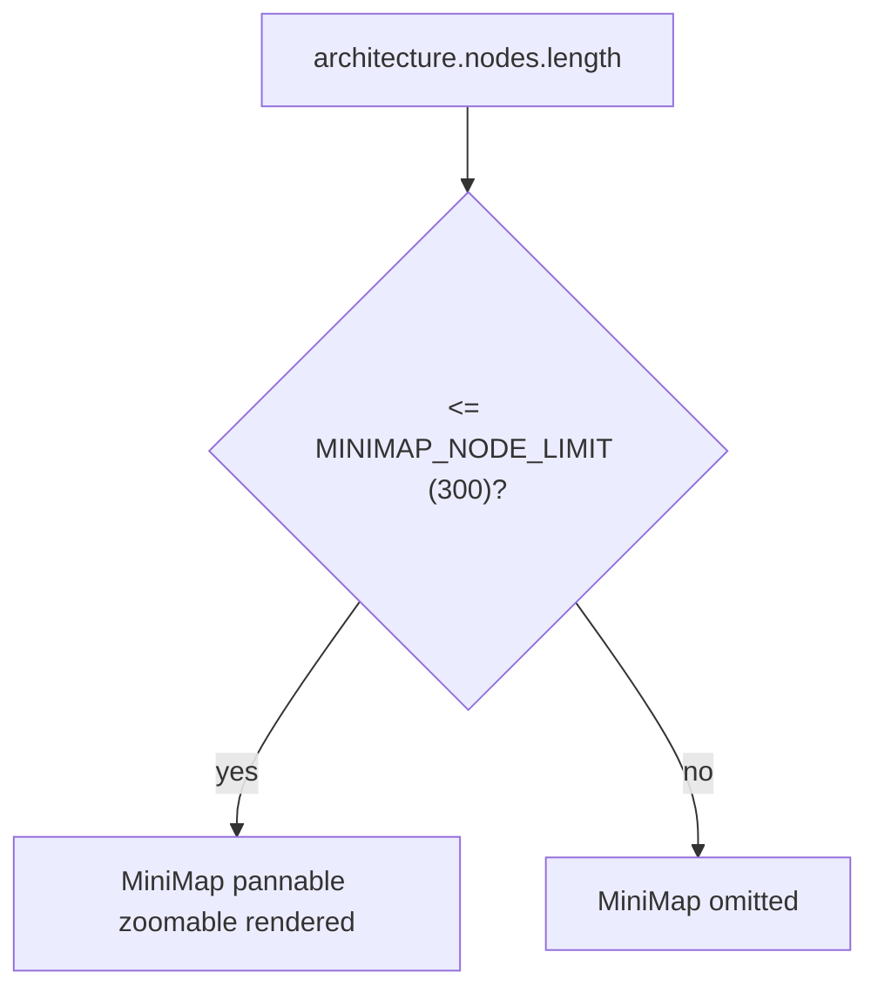

# MiniMap node-count guard

`MINIMAP_NODE_LIMIT` is a module-level constant fixed at `300`. Inside `<ReactFlow>`, the `<MiniMap pannable zoomable />` element is only rendered when `architecture.nodes.length <= MINIMAP_NODE_LIMIT`; above that count the minimap is omitted entirely rather than rendered and hidden. A code comment on the guard notes the reason: the minimap redraws every node's position on each mutation, so its per-mutation redraw cost is what dominates at scale, not the main canvas. The canvas itself separately sets `onlyRenderVisibleElements` on `<ReactFlow>` to limit its own render cost, independent of this guard.

**Source:** `src/components/architecture-canvas.tsx:114,291-301`

The check re-evaluates on every render of the node list, so crossing the 300-node threshold in either direction mounts or unmounts the minimap live, with no hysteresis band around the cutoff.
