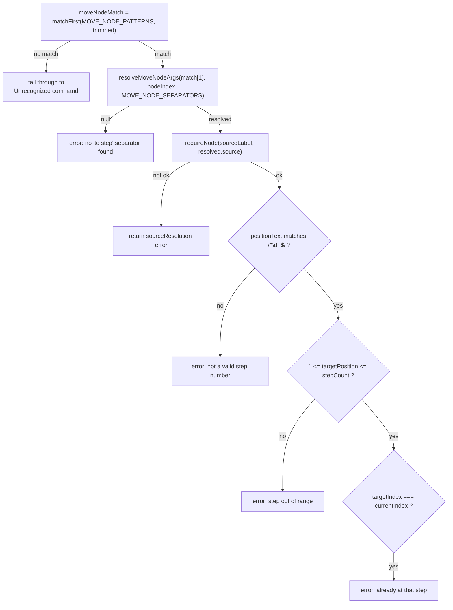
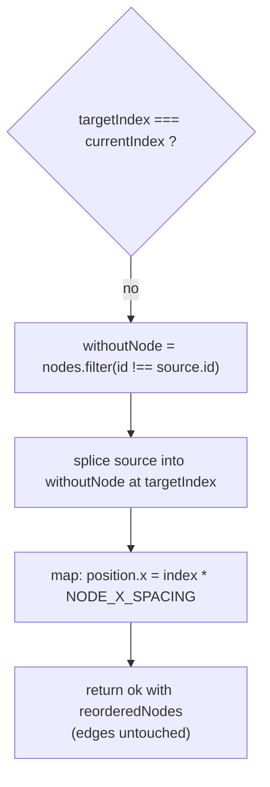

# `move node ... to step ...`

This handler filters the source node out of `architecture.nodes`, splices it back in at `targetIndex`, then re-derives every node's `x` from `index * NODE_X_SPACING`; edges stay untouched since they reference node `id`s, not array position.

**Source:** `src/lib/architecture-commands.ts:341-399`

**Command parsing and validation**

**Node reorder and x-relayout**

