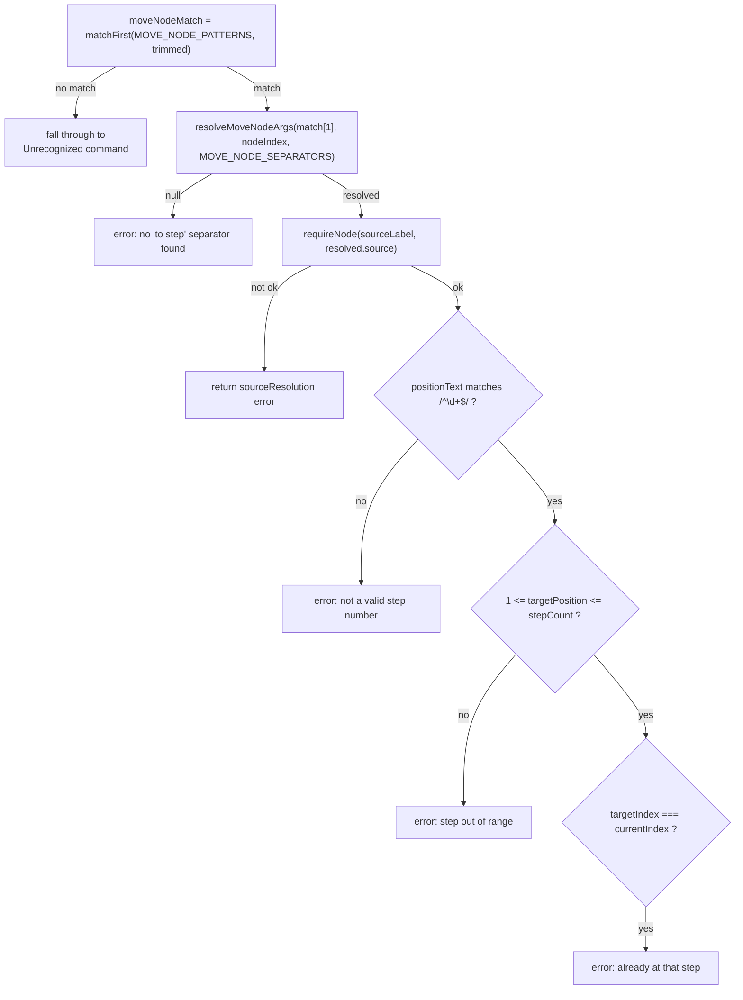
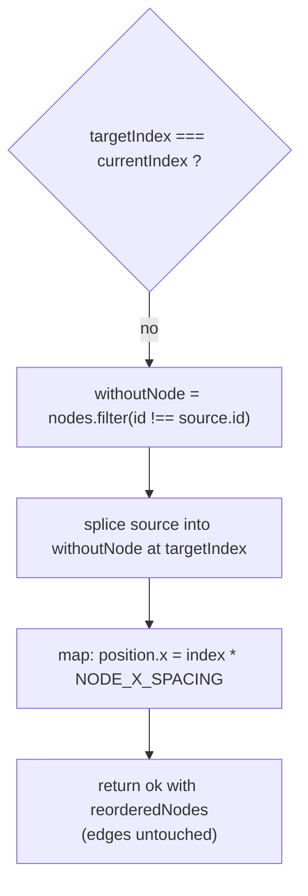

# `move node ... to step ...`

This handler reorders `architecture.nodes` by relocating one node to a new 1-based step position without touching any edges. It resolves the source label and a numeric `positionText` via `resolveMoveNodeArgs`, validates the target is an in-range integer step and not the node's current step, then filters the source out of the array, splices it back in at `targetIndex`, and re-derives every node's `x` position from its new array index (`index * NODE_X_SPACING`). Because edges reference node `id`s rather than array position, rewiring is unnecessary — only the ordering and each node's `x` coordinate change.

**Source:** `src/lib/architecture-commands.ts:667-725`

**Command parsing and validation**

**Node reorder and x-relayout**

The diagram makes it visible that edges are never read or rewritten in this branch: reordering is purely an array-splice-plus-x-relayout over `nodes`, relying on edges being keyed by node `id` (not by array index or position) to stay valid after the move.
