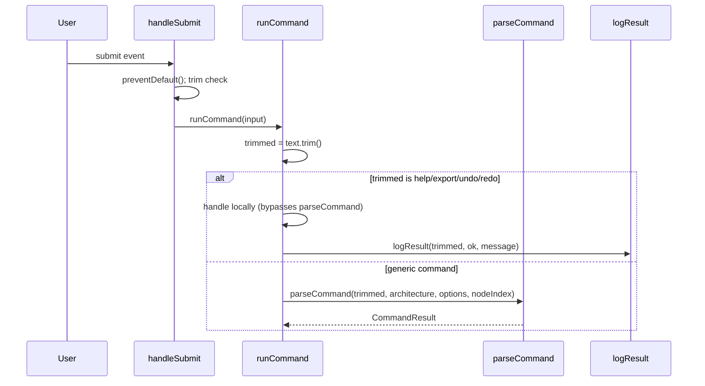
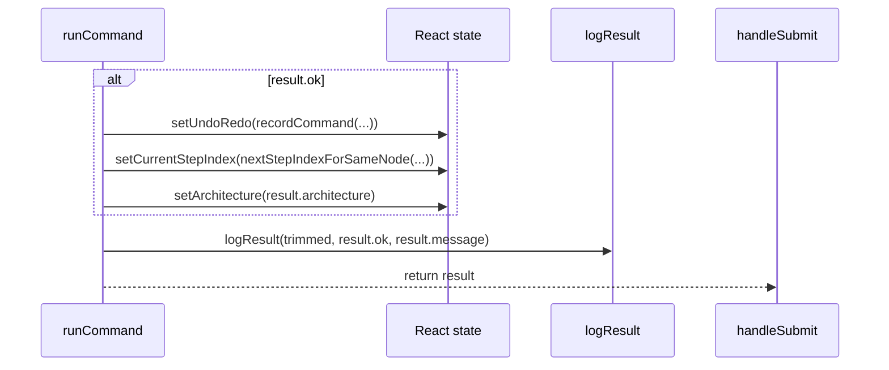

# Sole `parseCommand` call site

`runCommand`, a `useCallback` in `ArchitectureWorkspace` that both `handleSubmit` and programmatic callers funnel through, is the sole call site for `parseCommand`, short-circuiting `help`/`export`/`undo`/`redo` locally and only committing `setArchitecture(result.architecture)` when `result.ok` is true.

**Source:** `src/components/architecture-workspace.tsx:121-203`

**Dispatch: submit through parseCommand**

**Result handling: state commit and logging**

