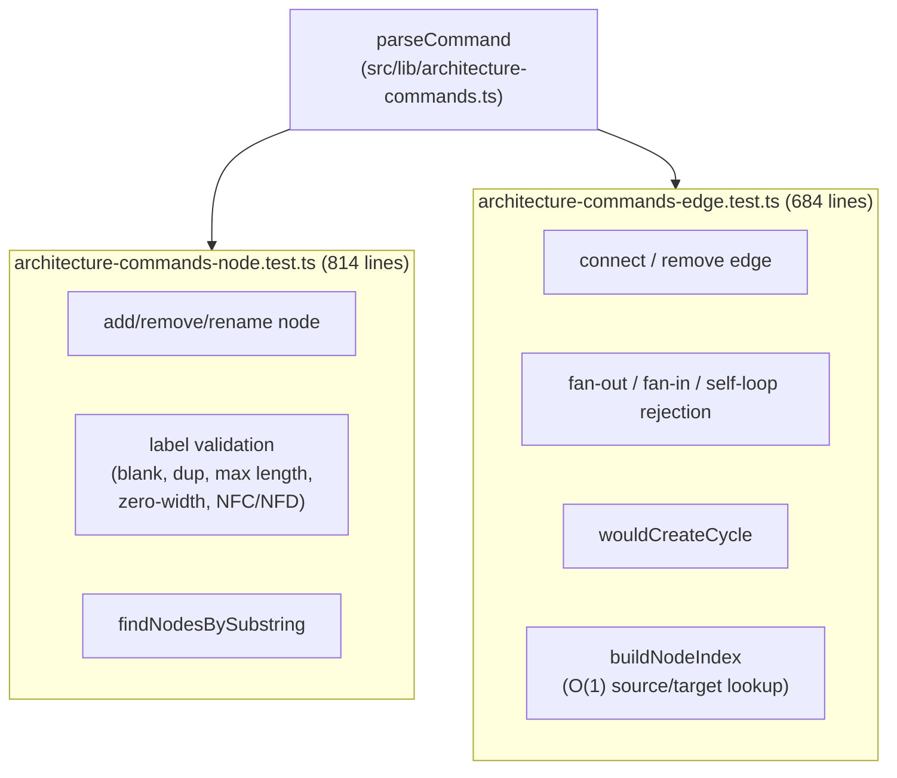
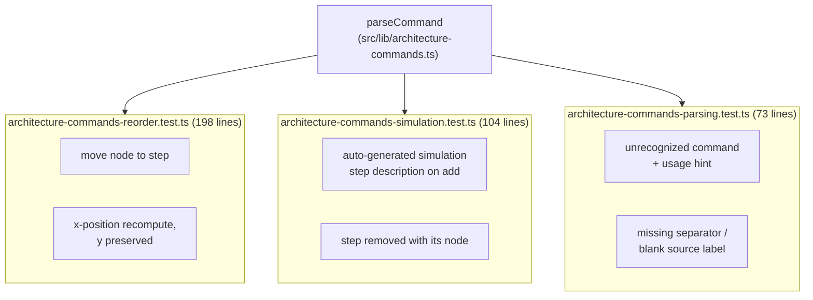

# Parser tests (5 files, 1,873 lines)

These five files test `parseCommand` against hand-built `Architecture` fixtures rather than mocks, with the node and edge files alone accounting for 1,498 lines because adversarial label cases are each asserted individually rather than table-driven.

**Source:** `src/lib/test/architecture-commands-*.test.ts`

**Node and edge command tests**

**Reorder, simulation, and parsing tests**

