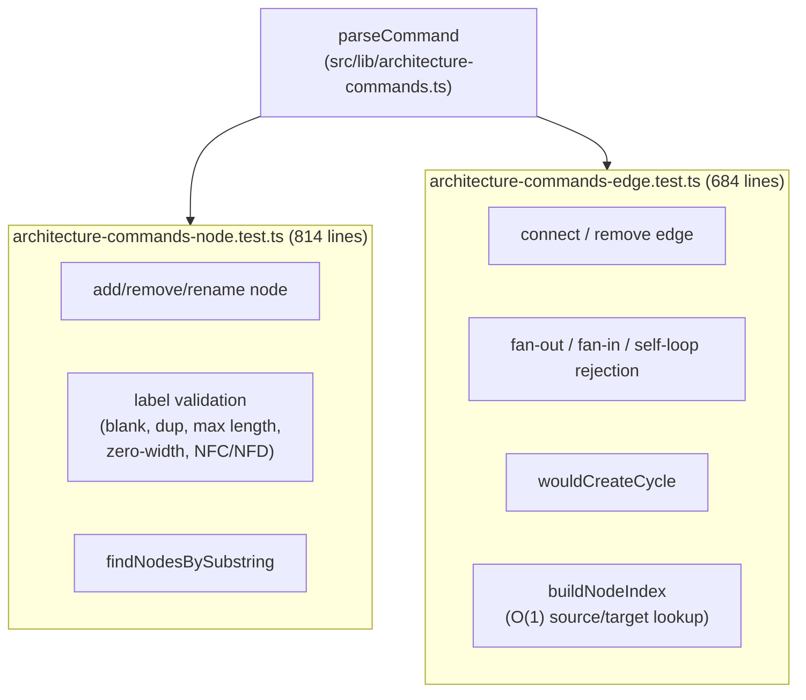
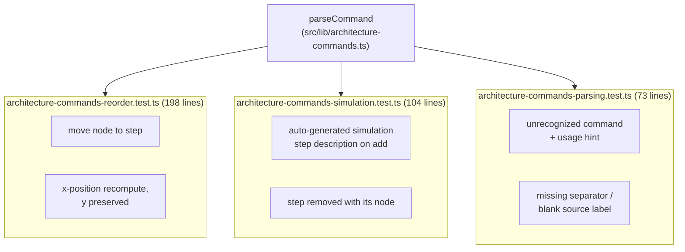

# Parser tests (5 files, 1,873 lines)

These five files are the test suite for `src/lib/architecture-commands.ts`, split by command family rather than kept as one file: node commands (add/remove/rename/find), edge commands (connect/remove edge/cycle detection), step reordering, simulation-step side effects, and generic command parsing/error paths. All five import `parseCommand` (plus, where relevant, the exported helpers `buildNodeIndex`, `wouldCreateCycle`, and `findNodesBySubstring`) directly from `@/lib/architecture-commands` and drive it with hand-built `Architecture` fixtures rather than mocking anything, so each test asserts on the real `result.ok` / `result.message` / mutated-architecture shape the parser returns. The edge and node files are by far the largest because they also cover adversarial label input -- duplicate/ambiguous references, zero-width and NFC/NFD Unicode variants, over-length labels, and fan-in/fan-out/cycle rejection -- alongside the happy path for each command.

**Source:** `src/lib/test/architecture-commands-*.test.ts`

**Node and edge command tests**

**Reorder, simulation, and parsing tests**

The size split is uneven on purpose: node and edge commands together account for 1,498 of the 1,873 lines because ambiguous-label and cycle-detection edge cases are each asserted individually rather than table-driven, while the parsing file stays at 5 tests because it only needs to prove the fallback/error path, not re-cover every command's happy path.
