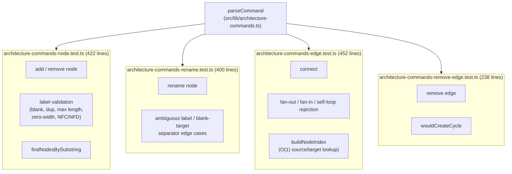
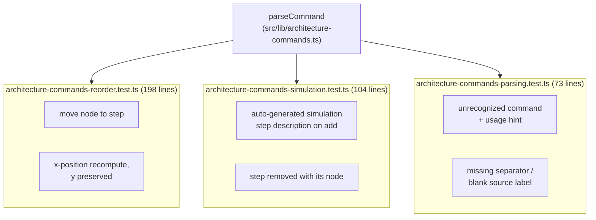

# Parser tests (7 files, 1,887 lines)

These seven files test `parseCommand` against hand-built `Architecture` fixtures rather than mocks, with the add/remove-node, rename-node, connect, and remove-edge files together accounting for 1,512 lines because adversarial label cases are each asserted individually rather than table-driven.

**Source:** `src/lib/test/architecture-commands-*.test.ts`

**Node and edge command tests**

**Reorder, simulation, and parsing tests**

