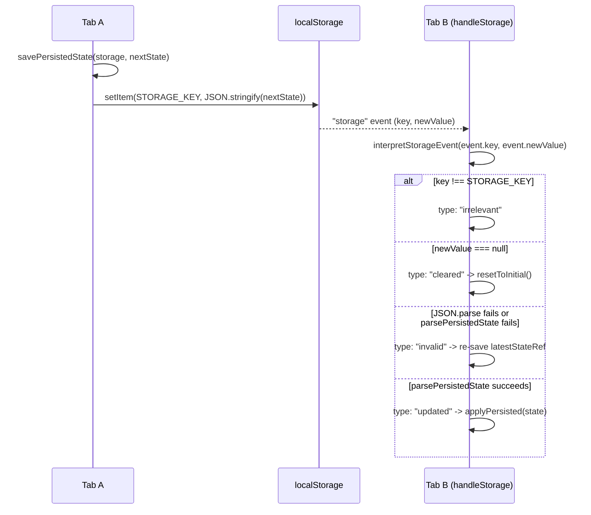

# Persistence (localStorage) + tab sync

`persistence.ts` stores the whole session (architecture graph, command log, simulation step, and speed index) under one `STORAGE_KEY` (`"architect-model:session"`), and validates rather than trusts whatever comes back out. `loadPersistedState` and `interpretStorageEvent` both funnel through the same `parsePersistedState`, which structurally checks every node and edge with `isArchitectureNode`/`isArchitectureEdge` and falls back to `stepIndex: 0, speedIndex: DEFAULT_SPEED_INDEX` for sessions saved before those fields existed. `savePersistedState`/`clearPersistedState`/`loadPersistedState` all wrap their storage call in try/catch and return a boolean or `null` instead of throwing, so a full or disabled localStorage degrades gracefully. `interpretStorageEvent` classifies a browser `storage` event (which only fires in *other* tabs) into `irrelevant` / `cleared` / `invalid` / `updated`, letting the caller in `architecture-workspace.tsx` react without re-deriving that logic itself.

**Source:** `src/lib/persistence.ts:24,64-170`

The "invalid" branch is the subtle part: if another tab writes something `interpretStorageEvent` can't parse, Tab B doesn't just ignore it -- it overwrites `STORAGE_KEY` with its own `latestStateRef`, effectively self-healing corrupted storage using whichever tab notices first.
