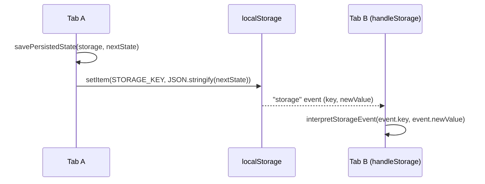
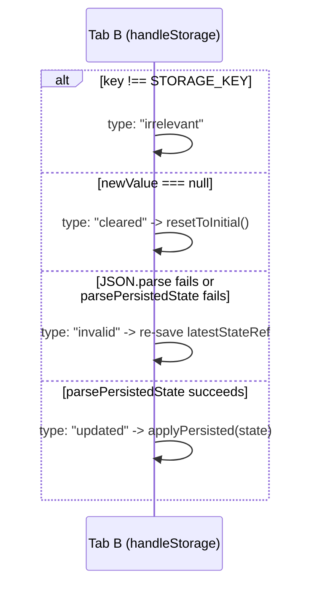

# Persistence (localStorage) + tab sync

`interpretStorageEvent` classifies a cross-tab browser `storage` event into `irrelevant`/`cleared`/`invalid`/`updated`, and on `invalid` — data another tab wrote that fails to parse — the receiving tab self-heals by overwriting `STORAGE_KEY` with its own `latestStateRef` rather than ignoring the write.

**Source:** `src/lib/persistence.ts:27,71-203`

**Save and cross-tab storage event**

**Classifying the storage event**

