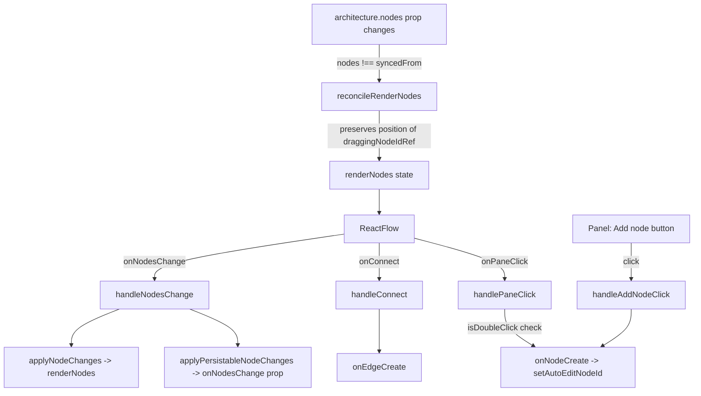
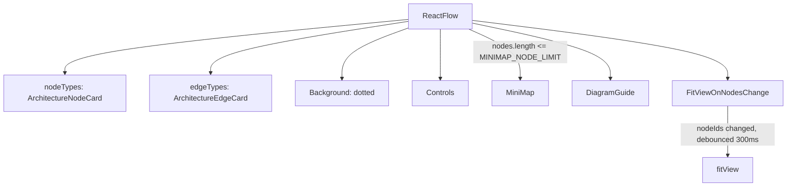

# React Flow canvas

`ArchitectureCanvas` bridges the app's `Architecture` state and React Flow's render state through `reconcileRenderNodes`, which preserves the live drag position of whichever node `draggingNodeIdRef` currently identifies, so drags never jump mid-gesture.

**Source:** `src/components/architecture-canvas.tsx:1-383`

**Prop sync and interaction handlers**

**ReactFlow's rendered children and fit-view**

