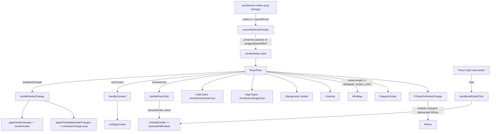

# React Flow canvas

`ArchitectureCanvas` wraps `@xyflow/react` and is the sole bridge between the app's own `Architecture` state and React Flow's internal render state. Incoming nodes are reconciled through `reconcileRenderNodes`, which preserves the live drag position of whichever node `draggingNodeIdRef` names, so an external update (e.g. from a command) can't yank a node the user is currently dragging. Interaction is funneled through a small set of handlers (`handleNodesChange`, `handleConnect`, `handlePaneClick`, `handleAddNodeClick`) that translate React Flow events into the app's own `onNodeCreate`/`onNodeRename`/`onNodeDelete`/`onEdgeCreate`/`onEdgeDelete` callbacks, and a double-click on the empty pane is detected manually via `isDoubleClick` on raw click timestamps/coordinates rather than a built-in React Flow event. The `MiniMap` is conditionally omitted above `MINIMAP_NODE_LIMIT` (300 nodes) because its per-mutation redraw cost dominates at scale, and `FitViewOnNodesChange` re-runs `fitView` on later node-set changes since the `fitView` prop only fires once on mount.

**Source:** `src/components/architecture-canvas.tsx:1-328`

The `nodeIds` string passed to `FitViewOnNodesChange` is a joined id list rather than the node array itself, so `fitView` only re-triggers when nodes are added or removed, not on every position/label edit.
